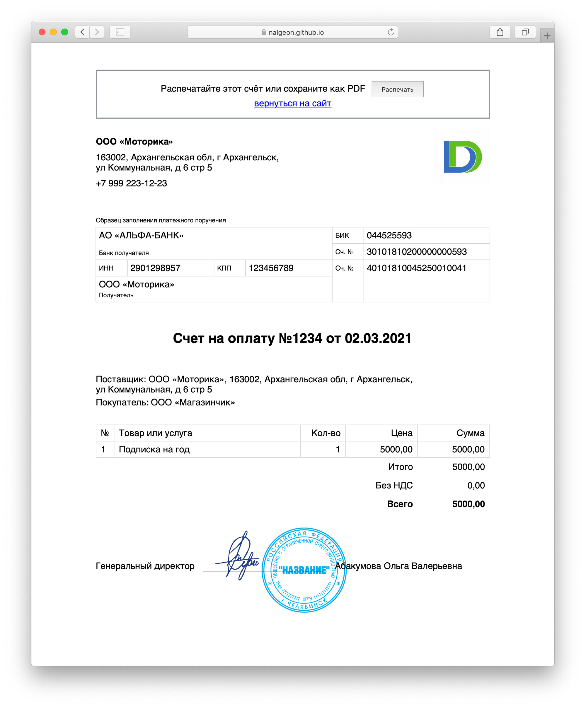

+++
date = 2021-03-02T14:19:02Z
description = "Все любят простые решения. Но иногда можно сделать даже проще, чем думаешь."
image = "/too-simple/cover.png"
slug = "too-simple"
tags = ["productology", "interface", "dadata"]
title = "Слишком простое решение"
subscribe = "dangry"
+++

Хорошие продакты, дизайнеры и инженеры любят простые решения — при условии, что они подходят пользователям. Но иногда можно сделать даже проще, чем думаешь.

Пример из жизни. Мы в «<a href="https://dadata.ru/">Дадате</a>» в основном работаем с юрлицами, а эти ребята умеют платить только по счету.

Мне в свое время категорически не хотелось тратить время на модуль выставления счетов, поэтому прошерстил весь рунет в поисках подходящего сервиса. Нашел миллион сайтов с конструкторами счетов, но только один с API — «Финолог». Он простой, подключились, пользовались, советовали другим.

Шло время, и «Финолог» начал барахлить. В целом, нужные фичи было легко повторить в «Дадате». Кроме одной — преобразования счета в PDF. А на мой взгляд, это было обязательно — что бухгалтеру делать со счетом, если его не скачать в пдф?

Однажды утром счета в «Финологе» тихо умерли. Техподдержка невозмутимо сообщила, что они решили навсегда отключить сервис счетов — вот так, одним днем и без объявления войны.

Ну ОК. Тут уж было не до изысков, так что за пару часов я сделал «выставление счетов» в виде одной статической странички. Параметры счета передавались прямо через строку запроса:
[invoice.html?number=1234&price=5000](https://nalgeon.github.io/invoice/invoice.html?number=1234&company=%D0%9E%D0%9E%D0%9E+%C2%AB%D0%9C%D0%B0%D0%B3%D0%B0%D0%B7%D0%B8%D0%BD%D1%87%D0%B8%D0%BA%C2%BB&item=%D0%9F%D0%BE%D0%B4%D0%BF%D0%B8%D1%81%D0%BA%D0%B0+%D0%BD%D0%B0+%D0%B3%D0%BE%D0%B4&price=5000) (ссылка рабочая, можете перейти и полюбоваться результатом).

И никакого PDF. Я подумал — отправить на принтер можно прямо из браузера, а если так уж нужен пдф, так современные браузеры умеют в него распечатывать.

И знаете что? За полгода только один человек не разобрался в новом интерфейсе. PDF-фича, которую я так ценил в «Финологе», оказалась никому не нужна. Заодно «Дадата» избавилась от лишней зависимости, что для облачного сервиса всегда плюс.

Такие дела. Иногда стоит взять и без того простую фичу, упростить еще и проверить — может, станет только лучше.

Ну а если вам вдруг очень срочно понадобится приделать счета на сайт — форкните [репозиторий](https://github.com/nalgeon/invoice), укажите реквизиты своей компании, и пользуйтесь. Дубовый вариант, но быстрый и рабочий.
