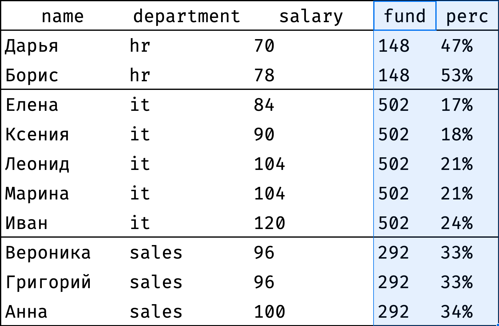
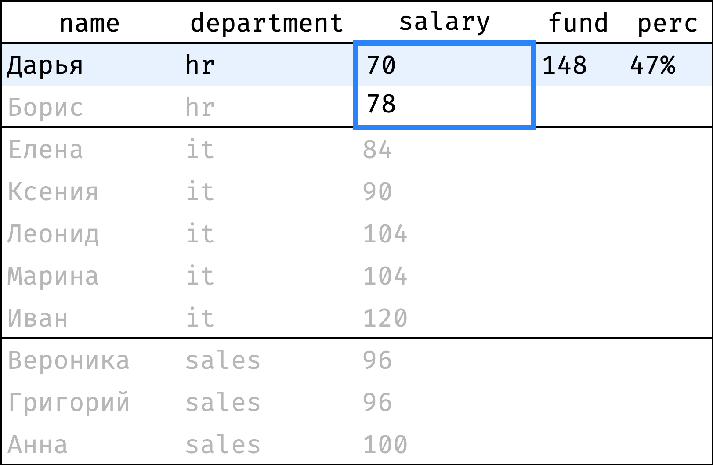
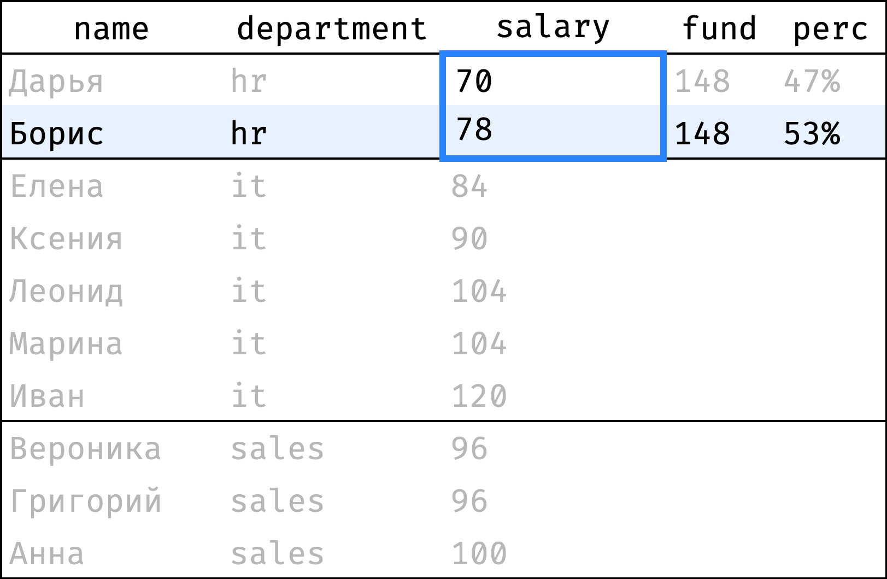
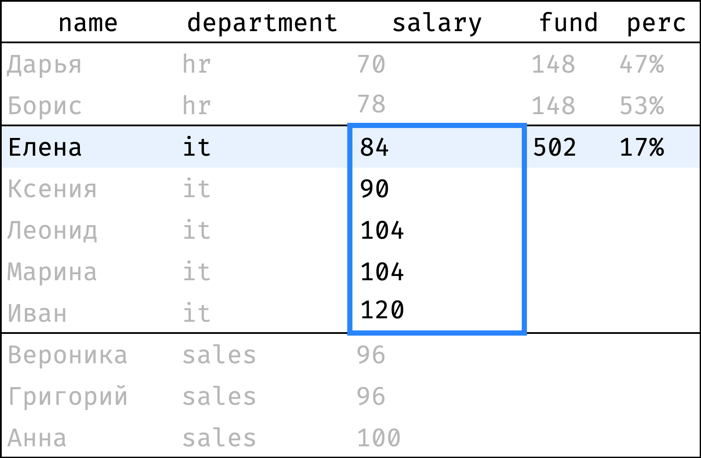
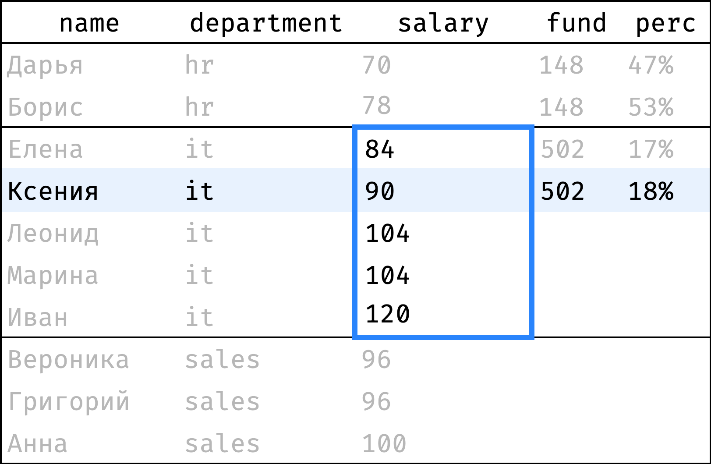
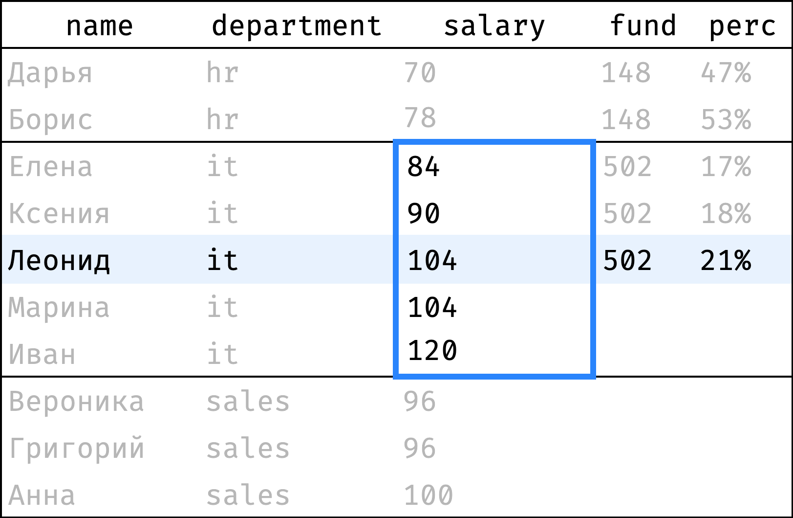
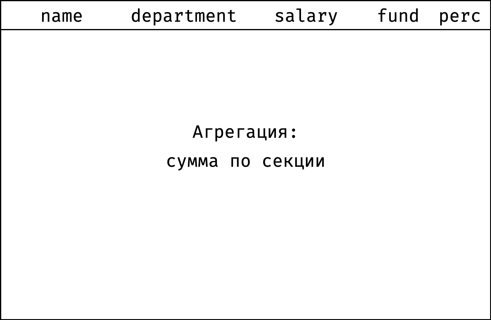

+++
date = 2021-04-29T14:44:36Z
description = "Считаем суммарные показатели."
image = "/window-aggregate/cover.png"
slug = "window-aggregate"
tags = ["data", "sqlite"]
title = "Оконные функции: агрегация"
+++

_Это четвертая статья из серии [Оконные функции в картинках](/window-functions). Рекомендую не просто читать, а [проходить курс](https://stepik.org/z/95367) — с ним знания превратятся в навыки._

Агрегация — это когда мы считаем суммарные или средние показатели. Например, среднюю зарплату по каждому региону или количество золотых медалей у каждой страны в зачете Олимпийских игр.

Мы будем агрегировать данные по сотрудникам из таблички `employees`:

```
┌────┬──────────┬────────┬────────────┬────────┐
│ id │   name   │  city  │ department │ salary │
├────┼──────────┼────────┼────────────┼────────┤
│ 11 │ Дарья    │ Самара │ hr         │ 70     │
│ 12 │ Борис    │ Самара │ hr         │ 78     │
│ 21 │ Елена    │ Самара │ it         │ 84     │
│ 22 │ Ксения   │ Москва │ it         │ 90     │
│ 23 │ Леонид   │ Самара │ it         │ 104    │
│ 24 │ Марина   │ Москва │ it         │ 104    │
│ 25 │ Иван     │ Москва │ it         │ 120    │
│ 31 │ Вероника │ Москва │ sales      │ 96     │
│ 32 │ Григорий │ Самара │ sales      │ 96     │
│ 33 │ Анна     │ Москва │ sales      │ 100    │
└────┴──────────┴────────┴────────────┴────────┘
```

<ul>
    <li><a href="#partition-sum">сумма по секции</a>,</li>
    <li><a href="#filtering">фильтрация</a>,</li>
    <li><a href="#window-description">описание окна</a>,</li>
    <li><a href="#functions">функции агрегации</a>.</li>
</ul>

Все запросы можно повторять [в песочнице](https://antonz.org/sqliter/sandbox/#window.db).

<h2 id="partition-sum">Сравнение с фондом оплаты труда</h2>

У каждого департамента есть фонд оплаты труда — денежная сумма, которая ежемесячно уходит на выплату зарплат сотрудникам. Посмотрим, какой процент от этого фонда составляет зарплата каждого сотрудника:

<div class="row">
<div class="col-xs-12 col-sm-6">
    <strong>Было</strong>
    <figure></figure>
</div>
<div class="col-xs-12 col-sm-6">
    <strong>Стало</strong>
    <figure></figure>
</div>
</div>

Столбец `fund` показывает фонд оплаты труда отдела, а `perc` — долю зарплаты сотрудника от этого фонда. Видно, что в HR и продажах все более-менее ровно, а у айтишников есть заметный разброс зарплат.

Как перейти от «было» к «стало»?

Отсортируем таблицу по департаментам:

```sql
select
  name, department, salary,
  null as fund,
  null as perc
from employees
order by department, salary, id;
```

```
┌──────────┬────────────┬────────┬──────┬──────┐
│   name   │ department │ salary │ fund │ perc │
├──────────┼────────────┼────────┼──────┼──────┤
│ Дарья    │ hr         │ 70     │      │      │
│ Борис    │ hr         │ 78     │      │      │
│ Елена    │ it         │ 84     │      │      │
│ Ксения   │ it         │ 90     │      │      │
│ Леонид   │ it         │ 104    │      │      │
│ Марина   │ it         │ 104    │      │      │
│ Иван     │ it         │ 120    │      │      │
│ Вероника │ sales      │ 96     │      │      │
│ Григорий │ sales      │ 96     │      │      │
│ Анна     │ sales      │ 100    │      │      │
└──────────┴────────────┴────────┴──────┴──────┘
```

Для удобства я добавил сортировку по зарплате и идентификатору. Но, как вы увидите дальше, в данном случае можно обойтись и без них.

Теперь пройдем от первой строчки до последней. На каждом шаге будем считать:

- `fund` — сумму зарплат по департаменту в целом (она одинакова для всех сотрудников департамента);
- `perc` — долю зарплаты сотрудника от этой суммы.

<div class="row">
<div class="col-xs-12 col-sm-6">
    1️⃣
    <figure></figure>
</div>
<div class="col-xs-12 col-sm-6">
    2️⃣
    <figure></figure>
</div>
</div>
<div class="row">
<div class="col-xs-12 col-sm-6">
    3️⃣
    <figure></figure>
</div>
<div class="col-xs-12 col-sm-6">
    4️⃣
    <figure></figure>
</div>
</div>
<div class="row">
<div class="col-xs-12 col-sm-6">
    5️⃣
    <figure></figure>
</div>
<div class="col-xs-12 col-sm-6 flex" style="align-items:center">
    <p>и так далее...</p>
</div>
</div>

Одной гифкой:

<div class="row">
<div class="col-xs-12 col-sm-6">
<figure>
  
</figure>
</div>
</div>

Окно состоит из секций по департаментам. При этом порядок записей в секции неважен: мы считаем сумму значений `salary`, а она не зависит от порядка.

```
window w as (
  partition by department
)
```

Для расчета `fund` подойдет обычная функция `sum()` — ее можно использовать поверх окна. А `perc` посчитаем как `salary / fund`:

```sql
select
  name, department, salary,
  sum(salary) over w as fund,
  round(salary * 100.0 / sum(salary) over w) as perc
from employees
window w as (partition by department)
order by department, salary, id;
```

```
┌──────────┬────────────┬────────┬──────┬──────┐
│   name   │ department │ salary │ fund │ perc │
├──────────┼────────────┼────────┼──────┼──────┤
│ Дарья    │ hr         │ 70     │ 148  │ 47.0 │
│ Борис    │ hr         │ 78     │ 148  │ 53.0 │
├──────────┼────────────┼────────┼──────┼──────┤
│ Елена    │ it         │ 84     │ 502  │ 17.0 │
│ Ксения   │ it         │ 90     │ 502  │ 18.0 │
│ Леонид   │ it         │ 104    │ 502  │ 21.0 │
│ Марина   │ it         │ 104    │ 502  │ 21.0 │
│ Иван     │ it         │ 120    │ 502  │ 24.0 │
├──────────┼────────────┼────────┼──────┼──────┤
│ Вероника │ sales      │ 96     │ 292  │ 33.0 │
│ Григорий │ sales      │ 96     │ 292  │ 33.0 │
│ Анна     │ sales      │ 100    │ 292  │ 34.0 │
└──────────┴────────────┴────────┴──────┴──────┘
```

Функция `sum()` работает без неожиданностей — считает сумму значений по всей секции, которой принадлежит текущая строка.

<h2 id="filtering">Фильтрация и порядок выполнения</h2>

Вернемся к запросу, который считал фонд оплаты труда по департаменту:

```sql
select
  name, department, salary,
  sum(salary) over w as fund
from employees
window w as (partition by department)
order by department, salary, id;
```

```
┌──────────┬────────────┬────────┬──────┐
│   name   │ department │ salary │ fund │
├──────────┼────────────┼────────┼──────┤
│ Дарья    │ hr         │ 70     │ 148  │
│ Борис    │ hr         │ 78     │ 148  │
│ Елена    │ it         │ 84     │ 502  │
│ Ксения   │ it         │ 90     │ 502  │
│ Леонид   │ it         │ 104    │ 502  │
│ Марина   │ it         │ 104    │ 502  │
│ Иван     │ it         │ 120    │ 502  │
│ Вероника │ sales      │ 96     │ 292  │
│ Григорий │ sales      │ 96     │ 292  │
│ Анна     │ sales      │ 100    │ 292  │
└──────────┴────────────┴────────┴──────┘
```

Допустим, мы хотим оставить в отчете только самарских сотрудников. Добавим фильтр:

```sql
select
  name, salary,
  sum(salary) over w as fund
from employees
where city = 'Самара'
window w as (partition by department)
order by department, salary, id;
```

```
┌──────────┬────────┬──────┐
│   name   │ salary │ fund │
├──────────┼────────┼──────┤
│ Дарья    │ 70     │ 148  │
│ Борис    │ 78     │ 148  │
│ Елена    │ 84     │ 188  │
│ Леонид   │ 104    │ 188  │
│ Григорий │ 96     │ 96   │
└──────────┴────────┴──────┘
```

Фильтр сработал. Вот только значения `fund` отличаются от ожидаемых:

<div class="row">
<div class="col-xs-12 col-sm-6">
    <strong>Ожидание</strong>
    <pre><code>┌──────────┬────────┬──────┐
│   name   │ salary │ fund │
├──────────┼────────┼──────┤
│ Дарья    │ 70     │ 148  │
│ Борис    │ 78     │ 148  │
│ Елена    │ 84     │ 502  │
│ Леонид   │ 104    │ 502  │
│ Григорий │ 96     │ 292  │
└──────────┴────────┴──────┘</code></pre>
</div>
<div class="col-xs-12 col-sm-6">
    <strong>Реальность</strong>
    <pre><code>┌──────────┬────────┬──────┐
│   name   │ salary │ fund │
├──────────┼────────┼──────┤
│ Дарья    │ 70     │ 148  │
│ Борис    │ 78     │ 148  │
│ Елена    │ 84     │ 188  │
│ Леонид   │ 104    │ 188  │
│ Григорий │ 96     │ 96   │
└──────────┴────────┴──────┘</code></pre>
</div>
</div>

Все дело в порядке выполнения операций. Вот в какой последовательности действует движок, когда выполняет запрос:

1. Взять нужные таблицы (`from`) и соединить их при необходимости (`join`).
2. Отфильтровать строки (`where`).
3. Сгруппировать строки (`group by`).
4. Отфильтровать результат группировки (`having`).
5. Взять конкретные столбцы из результата (`select`).
6. **Рассчитать значения оконных функций** (`function() over window`).
7. Отсортировать то, что получилось (`order by`).

Таким образом, окна отрабатывают предпоследним шагом, уже после фильтрации и группировки результатов. Поэтому в нашем запросе `fund` отражает не сумму всех зарплат по департаменту, а сумму только по самарским сотрудникам.

Решение — использовать подзапрос с окном и фильтровать его в основном запросе:

```sql
with emp as (
  select
    name, city, salary,
    sum(salary) over w as fund
  from employees
  window w as (partition by department)
  order by department, salary, id
)
select name, salary, fund
from emp
where city = 'Самара';
```

```
┌──────────┬────────┬──────┐
│   name   │ salary │ fund │
├──────────┼────────┼──────┤
│ Дарья    │ 70     │ 148  │
│ Борис    │ 78     │ 148  │
│ Елена    │ 84     │ 502  │
│ Леонид   │ 104    │ 502  │
│ Григорий │ 96     │ 292  │
└──────────┴────────┴──────┘
```

<h2 id="window-description">Описание окна</h2>

До сих пор мы описывали окно в блоке `window` и ссылались на него в выражении `over`:

```sql
select
  name, department, salary,
  count(*) over w as emp_count,
  sum(salary) over w as fund
from employees
window w as (partition by department)
order by department, salary, id;
```

```
┌──────────┬────────────┬────────┬───────────┬──────┐
│   name   │ department │ salary │ emp_count │ fund │
├──────────┼────────────┼────────┼───────────┼──────┤
│ Дарья    │ hr         │ 70     │ 2         │ 148  │
│ Борис    │ hr         │ 78     │ 2         │ 148  │
│ Елена    │ it         │ 84     │ 5         │ 502  │
│ Ксения   │ it         │ 90     │ 5         │ 502  │
│ Леонид   │ it         │ 104    │ 5         │ 502  │
│ Марина   │ it         │ 104    │ 5         │ 502  │
│ Иван     │ it         │ 120    │ 5         │ 502  │
│ Вероника │ sales      │ 96     │ 3         │ 292  │
│ Григорий │ sales      │ 96     │ 3         │ 292  │
│ Анна     │ sales      │ 100    │ 3         │ 292  │
└──────────┴────────────┴────────┴───────────┴──────┘
```

Это не единственный способ. SQL разрешает вообще не использовать `window` и описывать окно прямо внутри `over`:

```sql
select
  name, department, salary,
  count(*) over (partition by department) as emp_count,
  sum(salary) over (partition by department) as fund
from employees
order by department, salary, id;
```

Мне больше нравится вариант с `window` — его легче читать, и можно явно переиспользовать окно. Но в документации часто встречается определение окна внутри `over`, поэтому не удивляйтесь, когда увидите его.

Кстати, определение окна может быть пустым:

```sql
select
  name, department, salary,
  count(*) over () as emp_count,
  sum(salary) over () as fund
from employees
order by department, salary, id;
```

Такое окно включает все строки, так что `emp_count` покажет общее количество сотрудников, а `fund` — общий фонд оплаты труда по всем записям `employees`.

<h2 id="functions">Функции агрегации</h2>

<table>
    <tbody>
        <tr>
            <td class="nowrap"><code>min(value)</code></td>
            <td>минимальное <code>value</code> среди строк, входящих в окно</td>
        </tr>
        <tr>
            <td class="nowrap"><code>max(value)</code></td>
            <td>максимальное <code>value</code></td>
        </tr>
        <tr>
            <td class="nowrap"><code>count(value)</code></td>
            <td>количество <code>value</code>, не равных <code>null</code></td>
        </tr>
        <tr>
            <td class="nowrap"><code>avg(value)</code></td>
            <td>среднее значение по всем <code>value</code></td>
        </tr>
        <tr>
            <td class="nowrap"><code>sum(value)</code></td>
            <td>сумма значений <code>value</code></td>
        </tr>
        <tr>
            <td class="nowrap"><code>group_concat(value, separator)</code></td>
            <td>строка, которая соединяет значения <code>value</code> через разделитель <code>separator</code></td>
        </tr>
    </tbody>
</table>

<p class="align-center">⌘ ⌘ ⌘</p>

Мы разобрались, как считать фиксированные агрегаты в окнах. В <a href="/window-rolling/">следующей части</a> займемся скользящими агрегатами!

Чтобы закрепить знания на практике — <a href="https://stepik.org/z/95367"><strong>записывайтесь на курс</strong></a> 🚀


