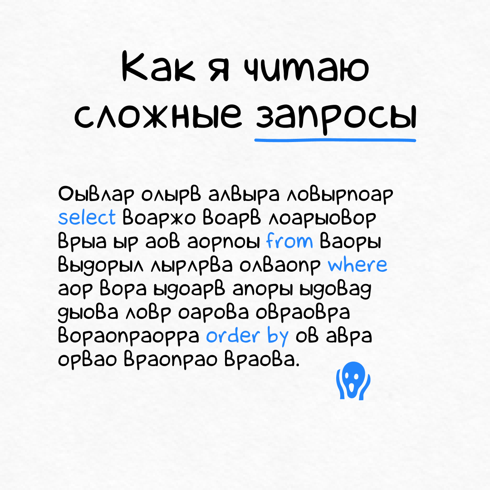
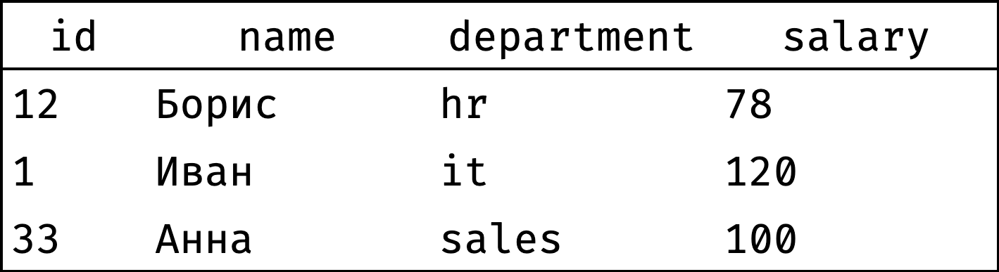
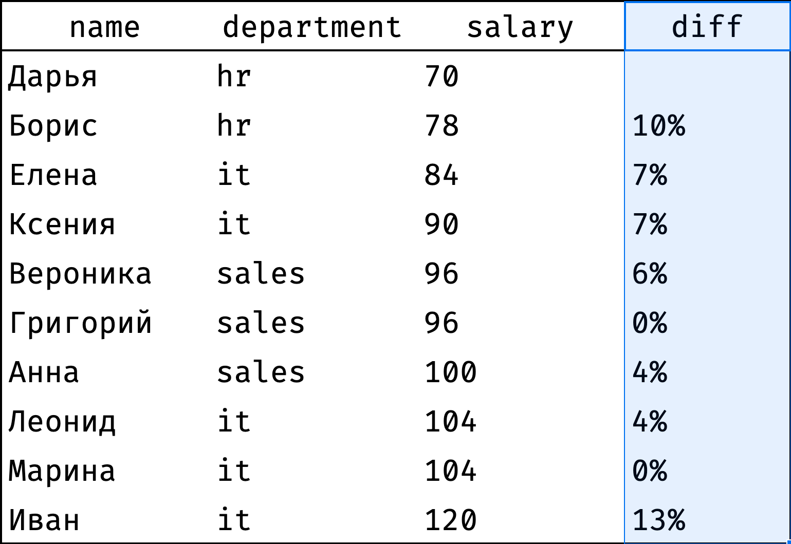
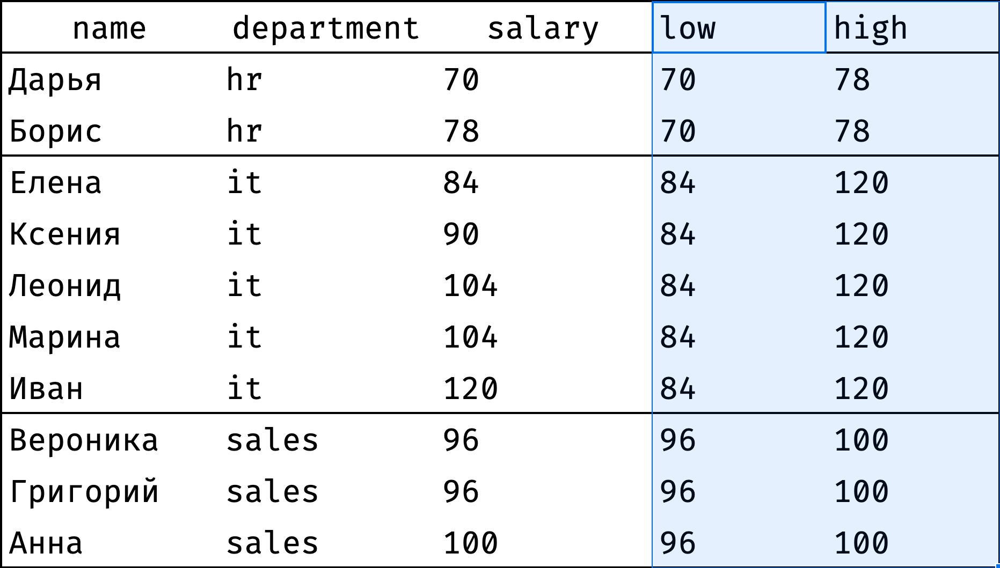
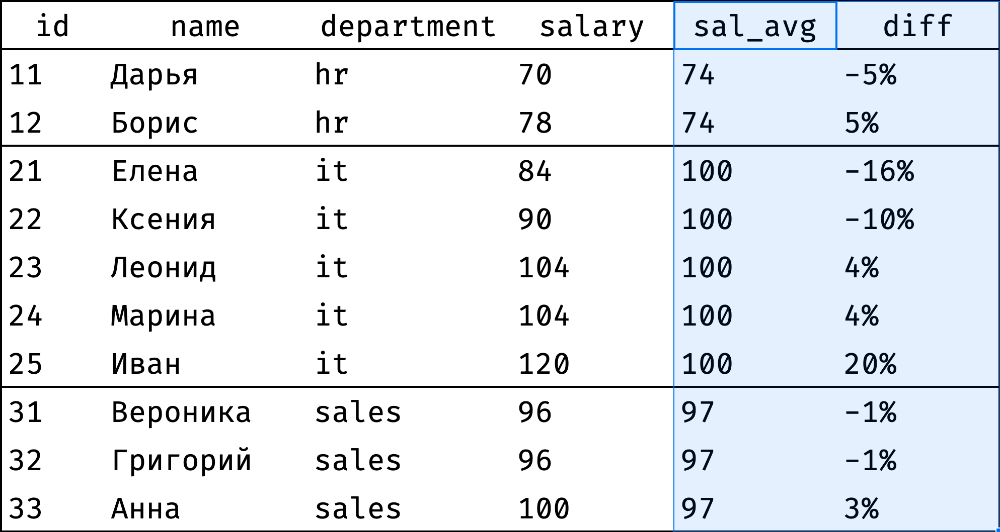
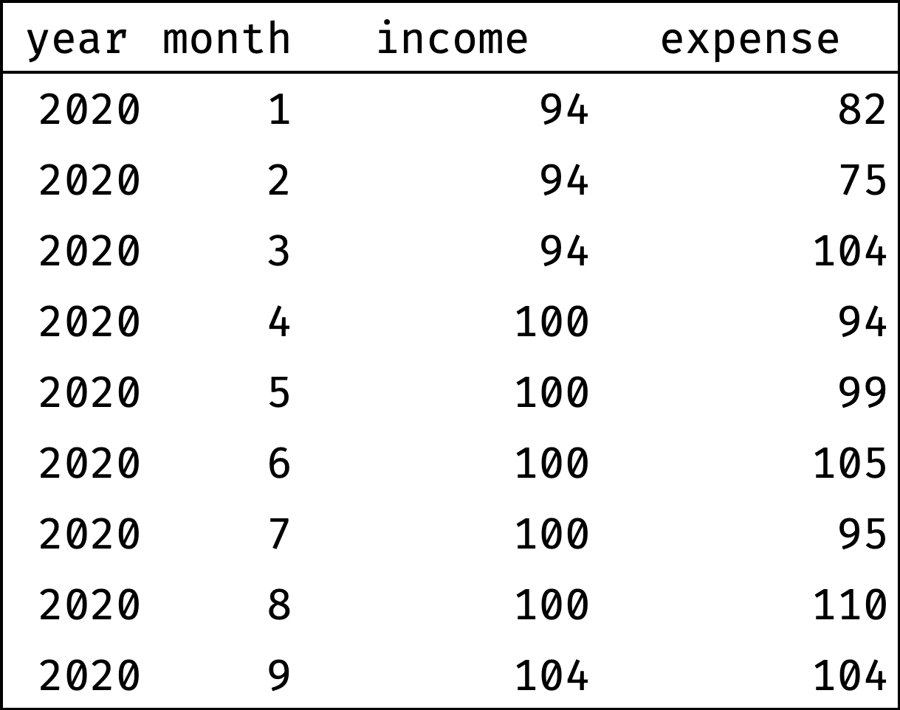
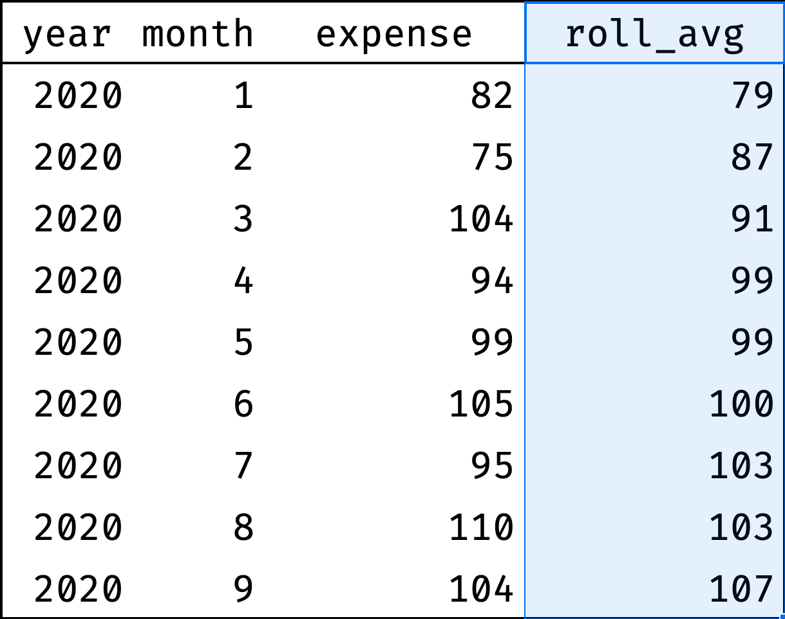

+++
date = 2021-03-15T09:20:42Z
description = "Понятное введение в «окошки» для всех, кто анализирует данные в SQL."
featured = true
image = "/window-functions/cover.png"
slug = "window-functions"
tags = ["data", "sqlite"]
title = "Оконные функции в картинках"
+++

Нет более обманчивого раздела SQL, чем «оконные функции». Когда слышишь эти слова, думаешь «наверно, просто придумали какие-то дополнительные функции».

Если вкратце — оконные функции помогают делать классные аналитические отчеты без участия «экселя». Хотите посчитать процент продаж по месяцам от общих продаж за год? Оконные функции. Разделить маркетинговые каналы на эффективные и неэффективные? Оконные функции. Выбрать топ-10 клиентов по каждому сегменту? Тоже они.

Я прочитал несколько десятков статей «для начинающих», которые объясняли, что такое оконные функции. Все они страдали от одной из двух проблем:

1. Все понятно, но описан 1% возможностей «окошек».
2. Написано так сложно, что если бы я уже не знал предмет обсуждения — ничего бы не понял.

<figure>
  
  <figcaption>Если не разобраться в запросах с «окошками»,
выглядят они как-то так</figcaption>
</figure>

Хочу исправить ситуацию и написать понятное и наглядное введение в оконные функции. Понятное, потому что я умею доходчиво писать о сложных темах. Наглядное — потому что подготовил несколько десятков картинок и гифок, которые помогут понять базовые принципы «окошек».

План такой:

1. Зачем нужны оконные функции (эта статья).
2. [Ранжирование](/window-ranking/)
3. [Смещение](/window-offset/)
4. [Агрегация](/window-aggregate/)
5. [Скользящие агрегаты](/window-rolling/)

Я рекомендую не просто читать статьи, а сразу <a href="https://stepik.org/z/95367"><strong>проходить курс</strong></a>. В нем много практических задачек, а только с ними абстрактные знания превратятся в навыки.

⌘&nbsp;⌘&nbsp;⌘

Итак, зачем нужны оконные функции? Проще всего объяснять на конкретных примерах. Будем работать с игрушечной таблицей сотрудников, вот такой:

<figure></figure>

Рассмотрим некоторые задачи, которые удобно решать с помощью «окошек» в SQL. Как именно их решать — разберемся в следующей части. Пока просто оценим возможности.

## 1. Ранжирование

Ранжирование — это всевозможные рейтинги, начиная от призеров чемпионата мира по плаванию и заканчивая Forbes 500.

На примере нашей таблички сотрудников:

**Общий рейтинг зарплат**

Составим рейтинг сотрудников по размеру заработной платы:

<figure></figure>

Видно, что у некоторых коллег одинаковая зарплата (Леонид и Марина, Вероника и Григорий) — поэтому они получили один и тот же ранг.

**Рейтинг зарплат по департаментам**

Тот же рейтинг, только не для всей компании, а по каждому департаменту в отдельности:

<figure></figure>

**Группы по зарплате**

Разобьем сотрудников на три группы в зависимости от размера зарплаты:

- высокооплачиваемые,
- средние,
- низкооплачиваемые.

<figure></figure>

**Самые «дорогие» коллеги**

Найдем самых высокооплачиваемых людей по каждому департаменту:

<figure></figure>

Что ж, этим зарплату больше не повышать! (или наоборот, повысить? 🤔)

## 2. Сравнение со смещением

Сравнение со смещением — это когда мы смотрим, в чем разница между соседними значениями. Например, сравниваем страны, которые занимают 5 и 6 место в мировом рейтинге ВВП — сильно ли отличаются? А если сравнить 1 и 6 место?

Сюда же попадают задачи, в которых мы сравниваем значение из набора с границами набора. Например, есть 100 лучших теннисисток мира. Мария Саккари занимает в рейтинге 20 место. Как ее показатели соотносятся с Эшли Бартли, которая занимает 1 место? А с Лин Чжоу, которая занимает 100 место?

На примере нашей таблички сотрудников:

**Разница по зарплате с предыдущим**

Упорядочим сотрудников по возрастанию зарплаты и проверим, велик ли разрыв между соседями:

<figure></figure>

Столбец `diff` показывает, на сколько процентов зарплата сотрудника отличается от предыдущего коллеги. Видно, что больших разрывов нет. Самые крупные — между Дарьей и Борисом (10%) и Мариной и Иваном (13%).

**Диапазон зарплат в департаменте**

Посмотрим, как зарплата сотрудника соотносится с минимальной и максимальной зарплатой в его департаменте:

<figure></figure>

Для каждого сотрудника столбец `low` показывает минимальную зарплату родного департамента, а столбец `high` — максимальную. Видно, что разброс значений в HR и продажах невелик, а у айтишников — значительный.

## 3. Агрегация

Агрегация — это когда мы считаем суммарные или средние показатели. Например, среднюю зарплату по каждому региону или количество золотых медалей у каждой страны в зачете Олимпийских игр.

На примере нашей таблички сотрудников:

**Сравнение с фондом оплаты труда**

У каждого департамента есть фонд оплаты труда — денежная сумма, которая ежемесячно уходит на выплату зарплат сотрудникам. Посмотрим, какой процент от этого фонда составляет зарплата каждого сотрудника:

<figure></figure>

Столбец `fund` показывает фонд оплаты труда отдела, а `perc` — долю зарплаты сотрудника от этого фонда. Видно, что в HR и продажах все более-менее ровно, а у айтишников есть заметный разброс зарплат.

**Сравнение со средней зарплатой**

Интересно, велик ли разброс зарплат в департаментах. Проверим: посчитаем отклонение зарплаты каждого сотрудника от средней по департаменту:

<figure></figure>

Результат подтверждает предыдущие наблюдения: у айтишников зарплаты колеблются от -16% до +20% от среднего, а у остальных департаментов отклонение в пределах 5%.

## 4. Скользящие агрегаты

Скользящие агрегаты — это те же сумма и среднее. Только рассчитывают их не по всем элементам набора, а более хитрым способом.

Поясню на примере. Здесь возьмем другую табличку — с доходами и расходами одного из сотрудников (пусть это будет Марина) за 9 месяцев 2020 года:

<figure></figure>

**Скользящее среднее по расходам**

Судя по данным, доходы у Марины растут: 94К ₽ в январе → 104К ₽ в сентябре. А вот растут ли расходы? Сходу сложно сказать, месяц на месяц не приходится. Чтобы сгладить эти скачки, используют «скользящее среднее» — для каждого месяца рассчитывают средний расход с учетом предыдущего и следующего месяца. Например:

- скользящее среднее за февраль = (январь + февраль + март) / 3;
- за март = (февраль + март + апрель) / 3;
- за апрель = (март + апрель + май) / 3;
- и так далее.

Рассчитаем скользящее среднее по всем месяцам:

<figure></figure>

Теперь хорошо видно, что расходы стабильно растут.

**Прибыль нарастающим итогом**

Мы выяснили, что растут и доходы, и расходы. А как они соотносятся друг с другом? Хочется понять, находится ли человек «в плюсе» или «в минусе» с учетом всех заработанных и потраченных денег.

Причем важно понимать не на конец года, а на каждый месяц. Потому что если по итогам года у Марины все ОК, а в июне ушла в минус — это потенциальная проблема (у компаний такую ситуацию называют «кассовым разрывом»).

Поэтому посчитаем доходы и расходы по месяцам нарастающим итогом (кумулятивно):

- кумулятивный доход за январь = январь;
- за февраль = январь + февраль;
- за март = январь + февраль + март;
- за апрель = январь + февраль + март + апрель;
- и так далее.

<figure></figure>

Теперь видно, что дела у Марины идут неплохо. В некоторых месяцах расходы превышают доходы, но благодаря накопленной «денежной подушке» кассового разрыва не происходит.

## Резюме

Вот задачи, которые непринужденно решаются с помощью оконных функций в SQL:

1. Ранжирование (всевозможные рейтинги).
2. Сравнение со смещением (соседние элементы и границы).
3. Агрегация (сумма и среднее).
4. Скользящие агрегаты (сумма и среднее в динамике).

Конечно, это не исчерпывающий список. Но, надеюсь, теперь понятно, как пригодятся оконные функции в аналитике данных. В [следующей части](/window-ranking/) разберемся, что такое «окно» и как работает оконная функция.

Чтобы закрепить знания на практике — <a href="https://stepik.org/z/95367"><strong>записывайтесь на курс</strong></a> 🚀

