+++
date = 2021-04-19T09:49:43Z
description = "Сравниваем соседние значения и границы диапазона."
image = "/window-offset/cover.png"
slug = "window-offset"
tags = ["data", "sqlite"]
title = "Оконные функции SQL: смещение"
subscribe = "sqliter"
+++

_Это третья статья из серии [Оконные функции в картинках](/window-functions). Рекомендую не просто читать, а [проходить курс](https://stepik.org/z/95367) — с ним знания превратятся в навыки._

Сравнение со смещением — это когда мы смотрим, в чем разница между соседними значениями. Например, сравниваем страны, которые занимают 5 и 6 место в мировом рейтинге ВВП — сильно ли отличаются? А если сравнить 1 и 6 место?

Сюда же попадают задачи, в которых мы сравниваем значение из набора с границами набора. Например, есть 100 лучших теннисисток мира. Мария Саккари занимает в рейтинге 20 место. Как ее показатели соотносятся с Эшли Бартли, которая занимает 1 место? А с Лин Чжоу, которая занимает 100 место?

Мы будем сравнить сотрудников из таблички `employees`:

```
┌────┬──────────┬────────┬────────────┬────────┐
│ id │   name   │  city  │ department │ salary │
├────┼──────────┼────────┼────────────┼────────┤
│ 11 │ Дарья    │ Самара │ hr         │ 70     │
│ 12 │ Борис    │ Самара │ hr         │ 78     │
│ 21 │ Елена    │ Самара │ it         │ 84     │
│ 22 │ Ксения   │ Москва │ it         │ 90     │
│ 23 │ Леонид   │ Самара │ it         │ 104    │
│ 24 │ Марина   │ Москва │ it         │ 104    │
│ 25 │ Иван     │ Москва │ it         │ 120    │
│ 31 │ Вероника │ Москва │ sales      │ 96     │
│ 32 │ Григорий │ Самара │ sales      │ 96     │
│ 33 │ Анна     │ Москва │ sales      │ 100    │
└────┴──────────┴────────┴────────────┴────────┘
```

<ul>
    <li><a href="#lag">сравнение с предыдущим</a>,</li>
    <li><a href="#nth">диапазон</a>,</li>
    <li><a href="#frame">окно, секция и фрейм</a>,</li>
    <li><a href="#functions">функции смещения</a>.</li>
</ul>

Все запросы можно повторять [в песочнице](https://antonz.org/sqliter/sandbox/#window.db).

<h2 id="lag">Разница по зарплате с предыдущим</h2>

Упорядочим сотрудников по возрастанию зарплаты и проверим, велик ли разрыв между соседями:

<div class="row">
<div class="col-xs-12 col-sm-6">
    <strong>Было</strong>
    <figure>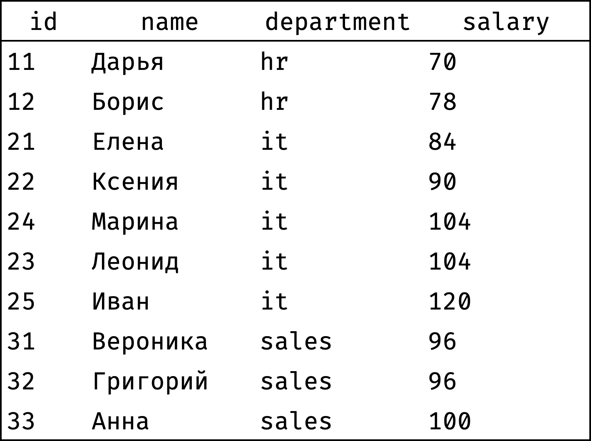</figure>
</div>
<div class="col-xs-12 col-sm-6">
    <strong>Стало</strong>
    <figure>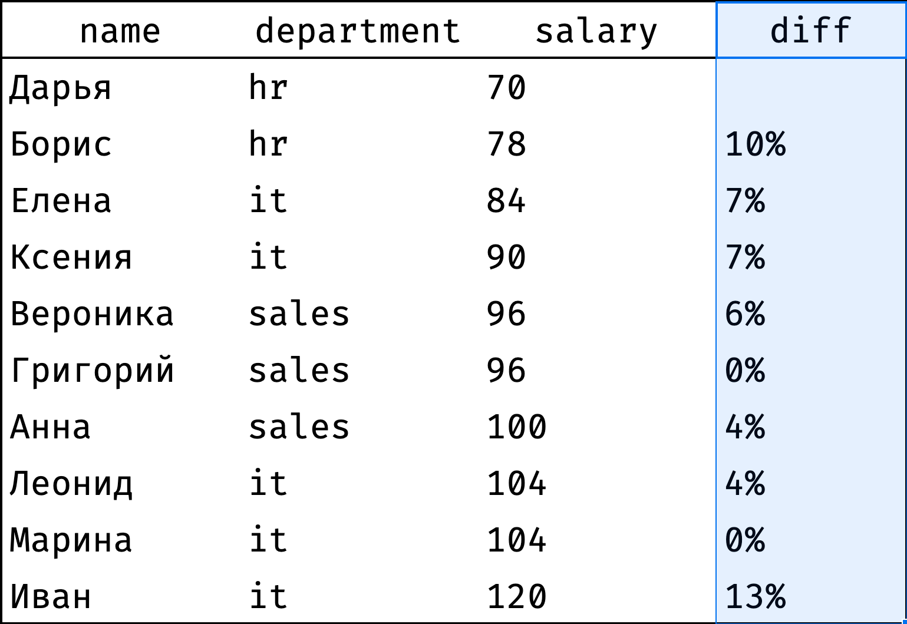</figure>
</div>
</div>

Столбец `diff` показывает, на сколько процентов зарплата сотрудника отличается от предыдущего коллеги. Видно, что больших разрывов нет. Самые крупные — между Дарьей и Борисом (10%) и Мариной и Иваном (13%).

Как перейти от «было» к «стало»?

Сначала отсортируем таблицу по возрастанию зарплаты:

```sql
select
  name, department, salary,
  null as prev
from employees
order by salary, id;
```

```
┌──────────┬────────────┬────────┬──────┐
│   name   │ department │ salary │ prev │
├──────────┼────────────┼────────┼──────┤
│ Дарья    │ hr         │ 70     │      │
│ Борис    │ hr         │ 78     │      │
│ Елена    │ it         │ 84     │      │
│ Ксения   │ it         │ 90     │      │
│ Вероника │ sales      │ 96     │      │
│ Григорий │ sales      │ 96     │      │
│ Анна     │ sales      │ 100    │      │
│ Леонид   │ it         │ 104    │      │
│ Марина   │ it         │ 104    │      │
│ Иван     │ it         │ 120    │      │
└──────────┴────────────┴────────┴──────┘
```

Теперь пройдем от первой строчки до последней, на каждом шаге «подтягивая» зарплату предыдущего сотрудника:

<div class="row">
<div class="col-xs-12 col-sm-6">
    1️⃣
    <figure>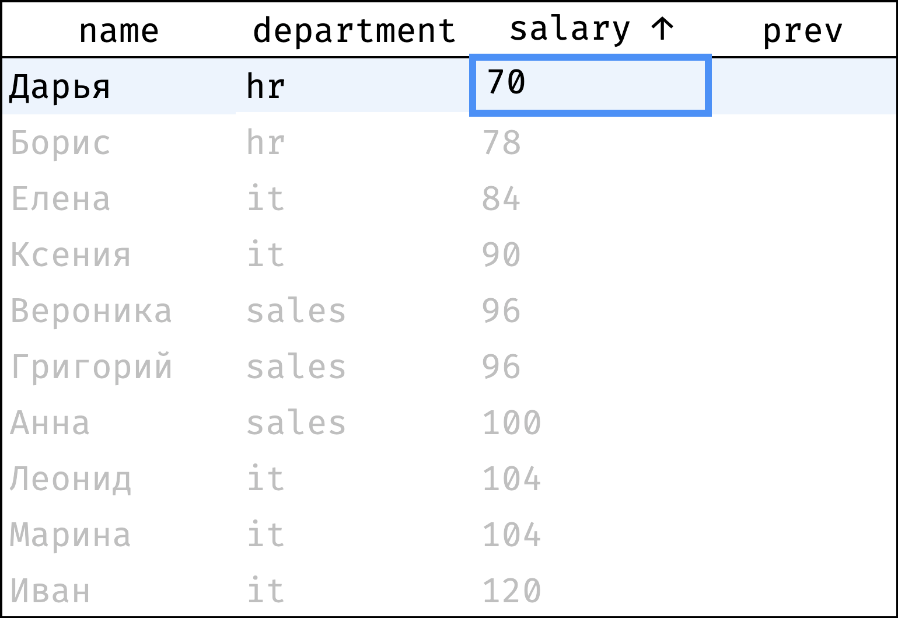</figure>
</div>
<div class="col-xs-12 col-sm-6">
    2️⃣
    <figure>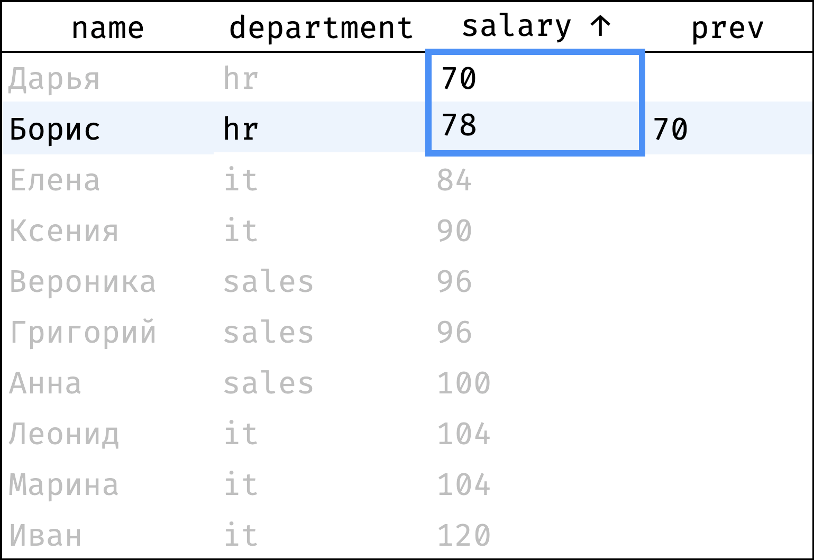</figure>
</div>
</div>
<div class="row">
<div class="col-xs-12 col-sm-6">
    3️⃣
    <figure>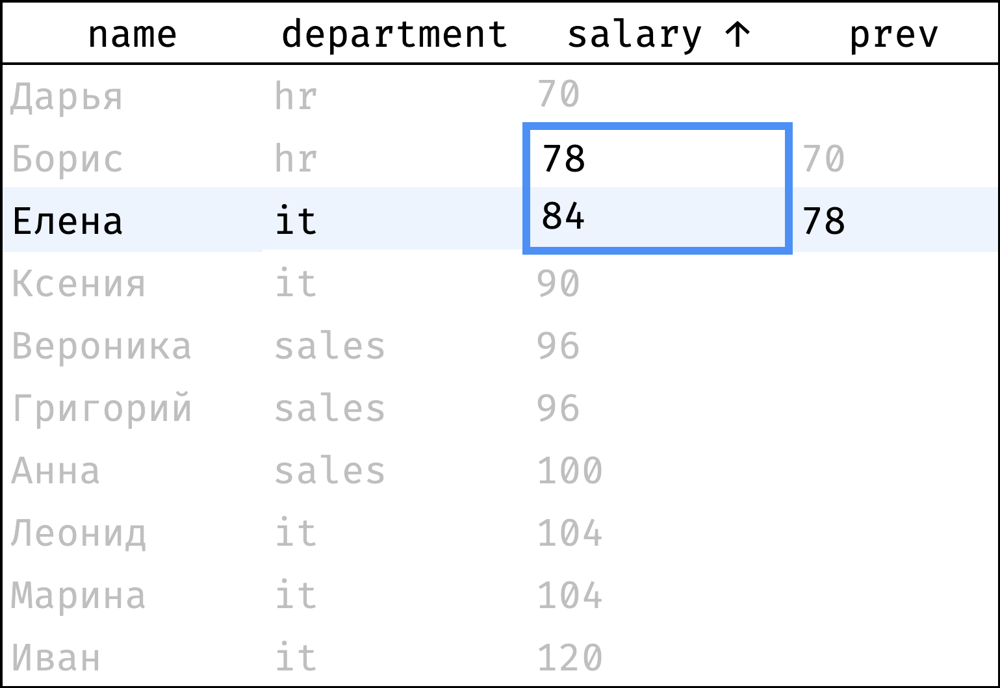</figure>
</div>
<div class="col-xs-12 col-sm-6">
    4️⃣
    <figure>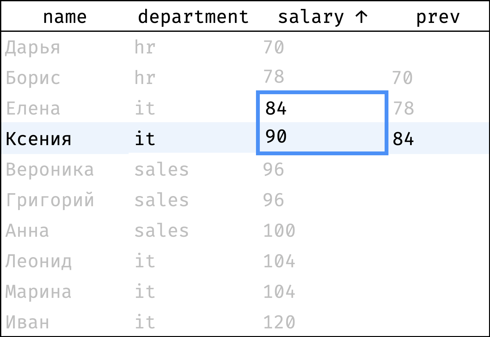</figure>
</div>
</div>
<div class="row">
<div class="col-xs-12 col-sm-6">
    5️⃣
    <figure>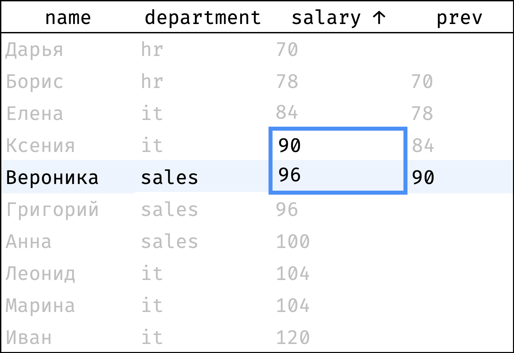</figure>
</div>
<div class="col-xs-12 col-sm-6 flex" style="align-items:center">
    <p>и так далее...</p>
</div>
</div>

Одной гифкой:

<div class="row">
<div class="col-xs-12 col-sm-6">
<figure>
  
</figure>
</div>
</div>

Видно, что окно в данном случае охватывает текущую и предыдущую запись. Оно сдвигается вниз на каждом шаге, скользит. Это логичная трактовка происходящего, и задать скользящее окно в SQL можно. Но у таких окон более сложный синтаксис, поэтому отложим их до статьи о скользящих агрегатах.

Вместо этого возьмем более простое и знакомое нам окно — все записи, упорядоченные по возрастанию `salary`:

```sql
window w as (order by salary)
```

<div class="row">
<div class="col-xs-12 col-sm-6">
<figure>
  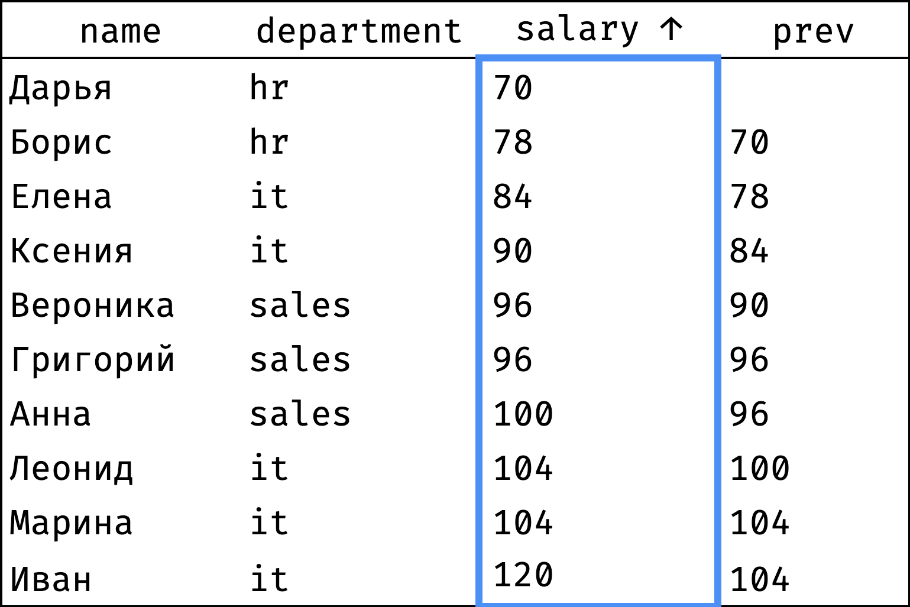
</figure>
</div>
</div>

А чтобы на каждом шаге подтягивать зарплату предыдущего сотрудника, будем использовать оконную функцию `lag()`:

```sql
lag(salary, 1) over w
```

Функция `lag()` возвращает значение из указанного столбца, отстоящее от текущего на указанное количество записей назад. В нашем случае — `salary` от предыдущей записи.

Добавим окно и оконную функцию в исходный запрос:

```sql
select
  id, name, department, salary,
  lag(salary, 1) over w as prev
from employees
window w as (order by salary)
order by salary, id;
```

```
┌────┬──────────┬────────────┬────────┬──────┐
│ id │   name   │ department │ salary │ prev │
├────┼──────────┼────────────┼────────┼──────┤
│ 11 │ Дарья    │ hr         │ 70     │      │
│ 12 │ Борис    │ hr         │ 78     │ 70   │
│ 21 │ Елена    │ it         │ 84     │ 78   │
│ 22 │ Ксения   │ it         │ 90     │ 84   │
│ 31 │ Вероника │ sales      │ 96     │ 90   │
│ 32 │ Григорий │ sales      │ 96     │ 96   │
│ 33 │ Анна     │ sales      │ 100    │ 96   │
│ 23 │ Леонид   │ it         │ 104    │ 100  │
│ 24 │ Марина   │ it         │ 104    │ 104  │
│ 25 │ Иван     │ it         │ 120    │ 104  │
└────┴──────────┴────────────┴────────┴──────┘
```

Столбец `prev` показывает зарплату предыдущего сотрудника. Осталось посчитать разницу между `prev` и `salary` в процентах:

```sql
select
  name, department, salary,
  round(
    (salary - lag(salary, 1) over w)*100.0 / salary
  ) as diff
from employees
window w as (order by salary)
order by salary, id;
```

```
┌──────────┬────────────┬────────┬──────┐
│   name   │ department │ salary │ diff │
├──────────┼────────────┼────────┼──────┤
│ Дарья    │ hr         │ 70     │      │
│ Борис    │ hr         │ 78     │ 10.0 │
│ Елена    │ it         │ 84     │ 7.0  │
│ Ксения   │ it         │ 90     │ 7.0  │
│ Вероника │ sales      │ 96     │ 6.0  │
│ Григорий │ sales      │ 96     │ 0.0  │
│ Анна     │ sales      │ 100    │ 4.0  │
│ Леонид   │ it         │ 104    │ 4.0  │
│ Марина   │ it         │ 104    │ 0.0  │
│ Иван     │ it         │ 120    │ 13.0 │
└──────────┴────────────┴────────┴──────┘
```

Здесь мы заменили `prev` → `lag(salary, 1) over w`. Конструкцию вида `function_name(...) over window_name` движок заменяет на конкретное значение, которое вернула функция. Так что оконную функцию можно вызывать прямо внутри вычислений, и вы не раз встретите такие запросы в документации и примерах.

<h2 id="nth">Диапазон зарплат в департаменте</h2>

Посмотрим, как зарплата сотрудника соотносится с минимальной и максимальной зарплатой в его департаменте:

<div class="row">
<div class="col-xs-12 col-sm-5">
    <strong>Было</strong>
    <figure></figure>
</div>
<div class="col-xs-12 col-sm-7">
    <strong>Стало</strong>
    <figure>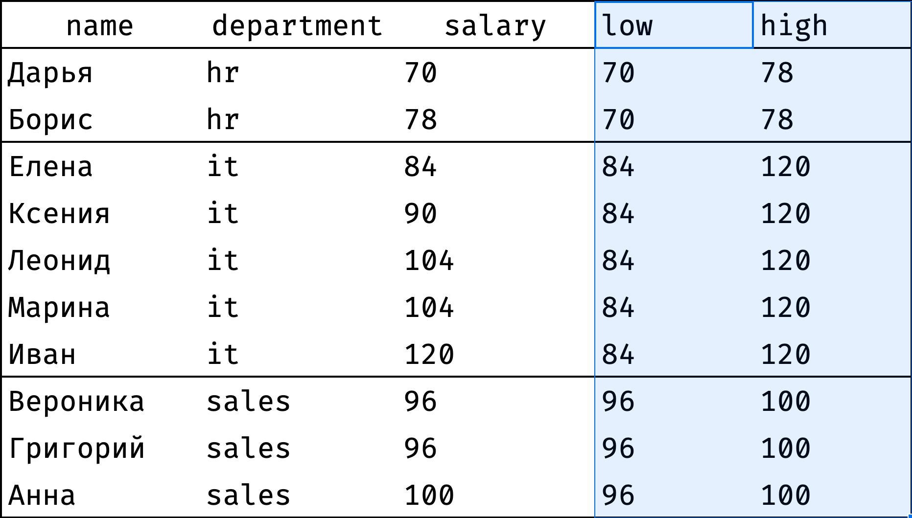</figure>
</div>
</div>

Для каждого сотрудника столбец `low` показывает минимальную зарплату родного департамента, а столбец `high` — максимальную.

Как перейти от «было» к «стало»?

Сначала отсортируем таблицу по департаментам, а внутри департамента — по возрастанию зарплаты:

```sql
select
  name, department, salary,
  null as low,
  null as high
from employees
order by department, salary, id;
```

```
┌──────────┬────────────┬────────┬─────┬──────┐
│   name   │ department │ salary │ low │ high │
├──────────┼────────────┼────────┼─────┼──────┤
│ Дарья    │ hr         │ 70     │     │      │
│ Борис    │ hr         │ 78     │     │      │
│ Елена    │ it         │ 84     │     │      │
│ Ксения   │ it         │ 90     │     │      │
│ Леонид   │ it         │ 104    │     │      │
│ Марина   │ it         │ 104    │     │      │
│ Иван     │ it         │ 120    │     │      │
│ Вероника │ sales      │ 96     │     │      │
│ Григорий │ sales      │ 96     │     │      │
│ Анна     │ sales      │ 100    │     │      │
└──────────┴────────────┴────────┴─────┴──────┘
```

Теперь пройдем от первой строчки до последней, на каждом шаге «подтягивая» наименьшую и наибольшую зарплаты в отделе:

<div class="row">
<div class="col-xs-12 col-sm-6">
    1️⃣
    <figure>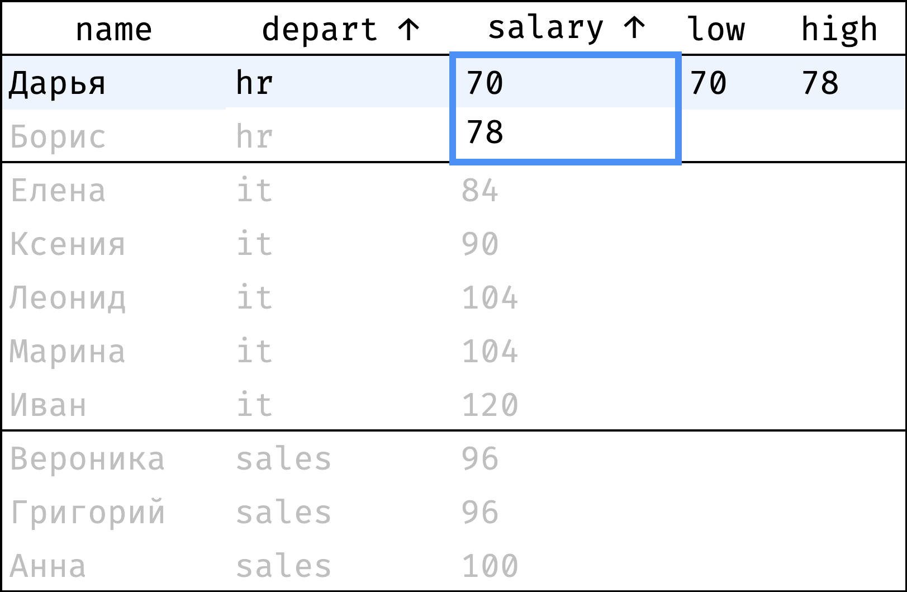</figure>
</div>
<div class="col-xs-12 col-sm-6">
    2️⃣
    <figure>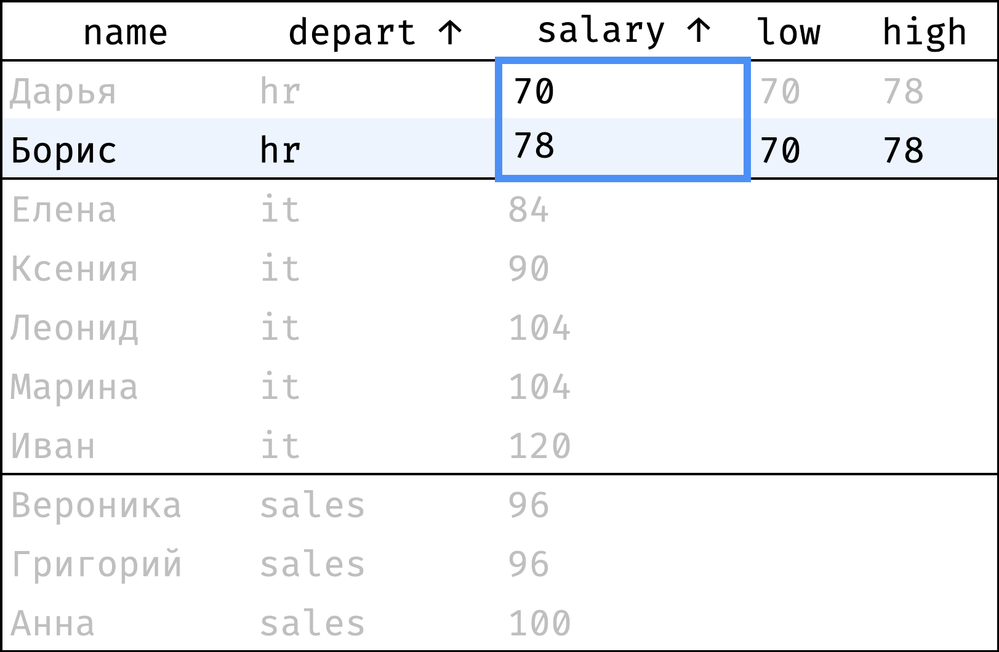</figure>
</div>
</div>
<div class="row">
<div class="col-xs-12 col-sm-6">
    3️⃣
    <figure>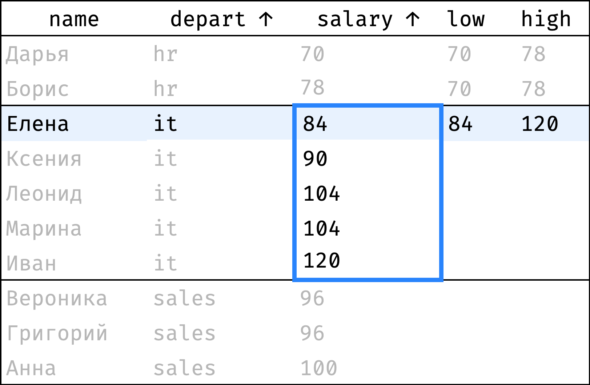</figure>
</div>
<div class="col-xs-12 col-sm-6">
    4️⃣
    <figure>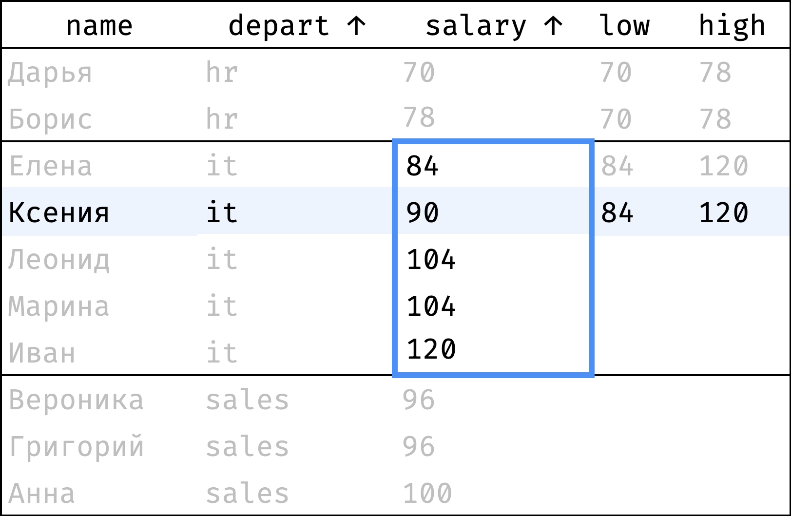</figure>
</div>
</div>
<div class="row">
<div class="col-xs-12 col-sm-6">
    5️⃣
    <figure>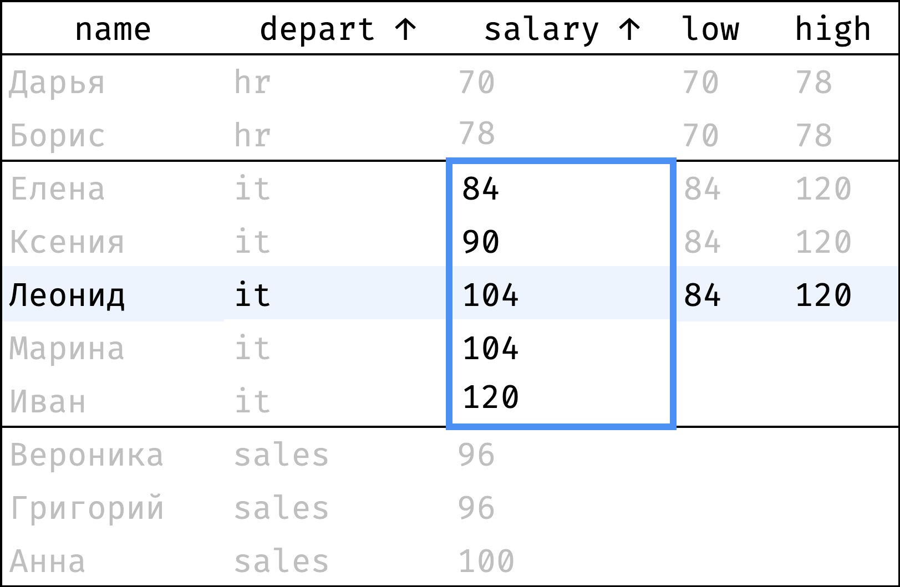</figure>
</div>
<div class="col-xs-12 col-sm-6 flex" style="align-items:center">
    <p>и так далее...</p>
</div>
</div>

Одной гифкой:

<div class="row">
<div class="col-xs-12 col-sm-6">
<figure>
  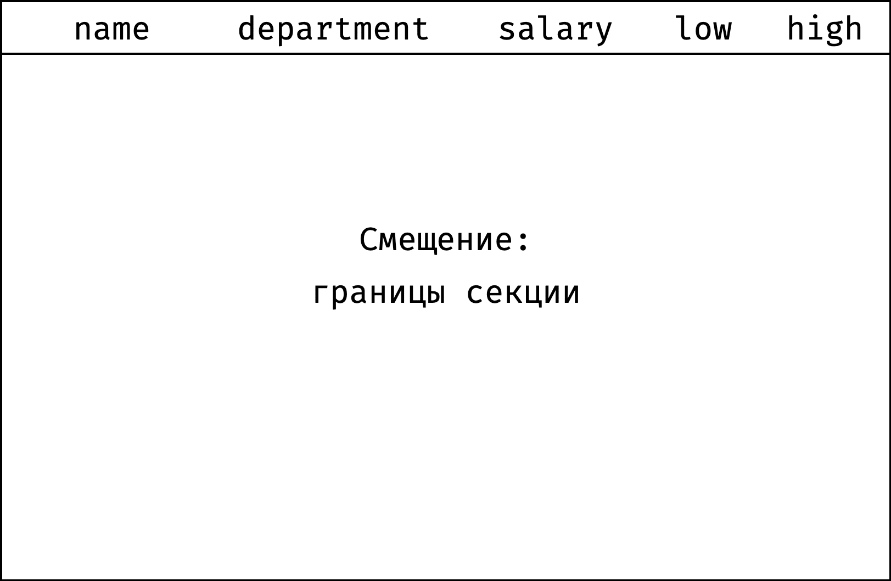
</figure>
</div>
</div>

Окно состоит из трех секций. Секция на каждом шаге охватывает весь департамент сотрудника. Записи при этом упорядочены по возрастанию зарплаты внутри департамента, чтобы минимальная и максимальная зарплаты всегда находились на границах секции:

```sql
window w as (
  partition by department
  order by salary
)
```

Хотелось бы воспользоваться функциями `lag()` и `lead()`, чтобы получить диапазон зарплат в отделе. Но они заглядывают на фиксированное количество записей назад или вперед. Нам же требуется нечто другое:

- `low` — зарплата первого сотрудника, входящего в секцию окна;
- `high` — зарплата последнего сотрудника, входящего в секцию.

К счастью, есть оконные функции ровно для этого:

```sql
first_value(salary) over w as low,
last_value(salary) over w as high
```

Добавим окно и оконную функцию в исходный запрос:

```sql
select
  name, department, salary,
  first_value(salary) over w as low,
  last_value(salary) over w as high
from employees
window w as (
  partition by department
  order by salary
)
order by department, salary, id;
```

```
┌──────────┬────────────┬────────┬─────┬──────┐
│   name   │ department │ salary │ low │ high │
├──────────┼────────────┼────────┼─────┼──────┤
│ Дарья    │ hr         │ 70     │ 70  │ 70   │
│ Борис    │ hr         │ 78     │ 70  │ 78   │
├──────────┼────────────┼────────┼─────┼──────┤
│ Елена    │ it         │ 84     │ 84  │ 84   │
│ Ксения   │ it         │ 90     │ 84  │ 90   │
│ Леонид   │ it         │ 104    │ 84  │ 104  │
│ Марина   │ it         │ 104    │ 84  │ 104  │
│ Иван     │ it         │ 120    │ 84  │ 120  │
├──────────┼────────────┼────────┼─────┼──────┤
│ Вероника │ sales      │ 96     │ 96  │ 96   │
│ Григорий │ sales      │ 96     │ 96  │ 96   │
│ Анна     │ sales      │ 100    │ 96  │ 100  │
└──────────┴────────────┴────────┴─────┴──────┘
```

`low` рассчитался корректно, а вот с `high` какая-то ерунда. Вместо того, чтобы равняться максимальной зарплате департамента, он меняется от сотрудника к сотруднику. Что ж, давайте разбираться.

<h2 id="frame">Окно, секция, фрейм</h2>

До сих пор все было логично:

- есть окно, которое состоит из одной или нескольких секций;
- внутри секции записи упорядочены по конкретному столбцу.

На предыдущем шаге мы разделили окно на три секции — по департаментам, и упорядочили записи внутри секций по зарплате:

```sql
window w as (
  partition by department
  order by salary
)
```

Допустим, движок выполняет запрос, и текущая запись — Леонид из it-отдела. Мы ожидаем, что `first_value()` вернет первую запись it-секции (`salary = 84`), а `last_value()` — последнюю (`salary = 120`):

Вместо этого `last_value()` возвращает `salary = 104`:

<div class="row">
<div class="col-xs-12 col-sm-6">
    <strong>Ожидание</strong>
    <figure>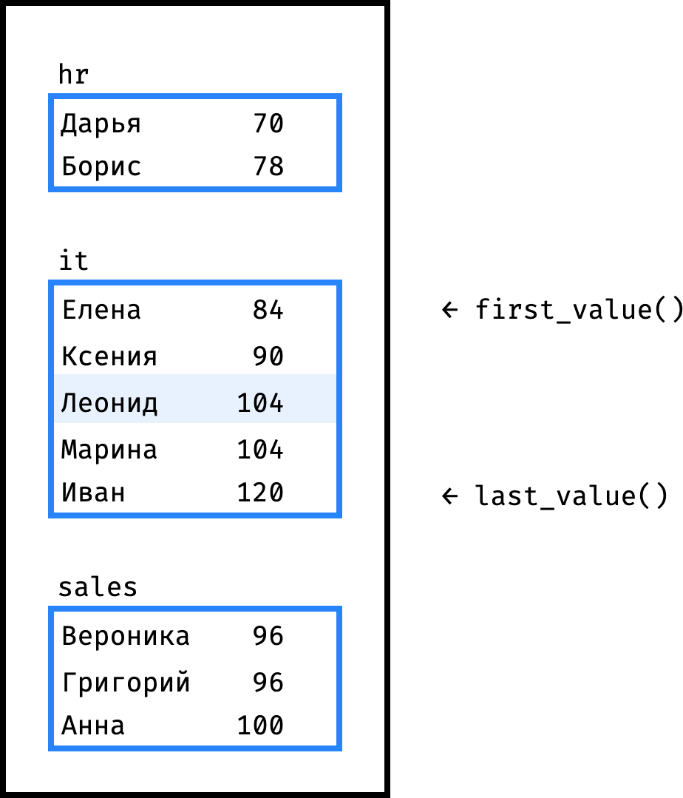</figure>
</div>
<div class="col-xs-12 col-sm-6">
    <strong>Реальность</strong>
    <figure>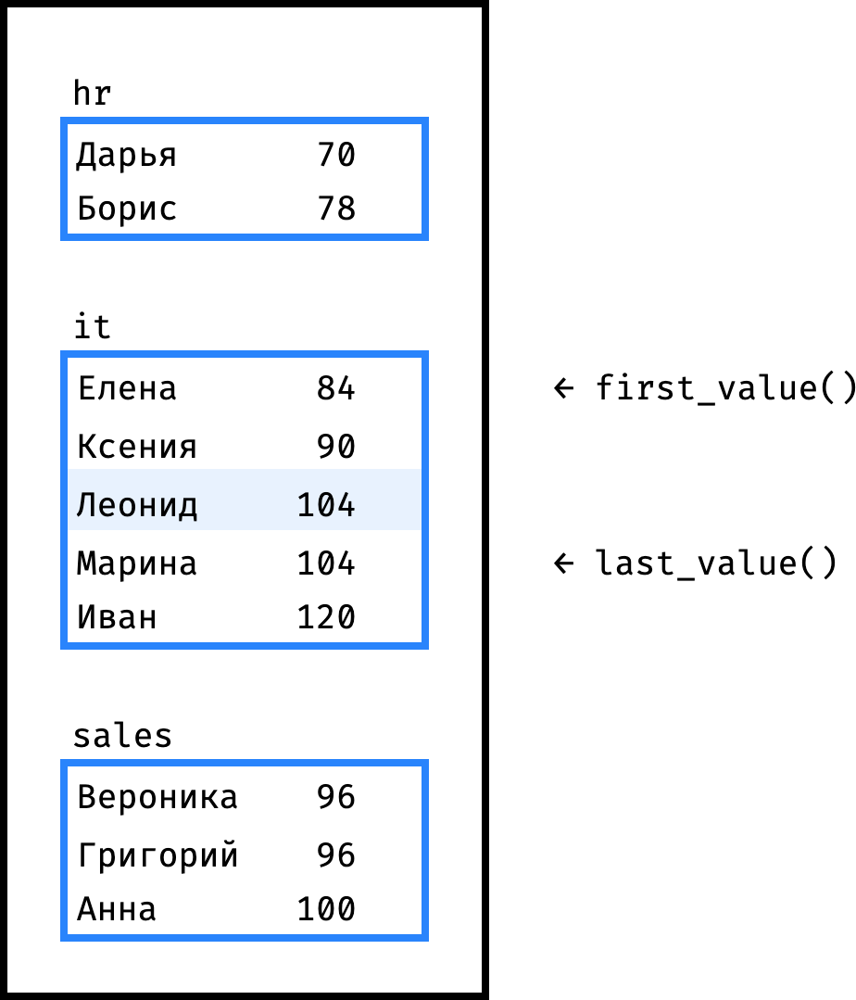</figure>
</div>
</div>

Дело в том, что функции `first_value()` и `last_value()` работают не просто с секцией окна. Они работают с _фреймом_ внутри секции:

<div class="row">
<div class="col-xs-12 col-sm-6">
    <figure>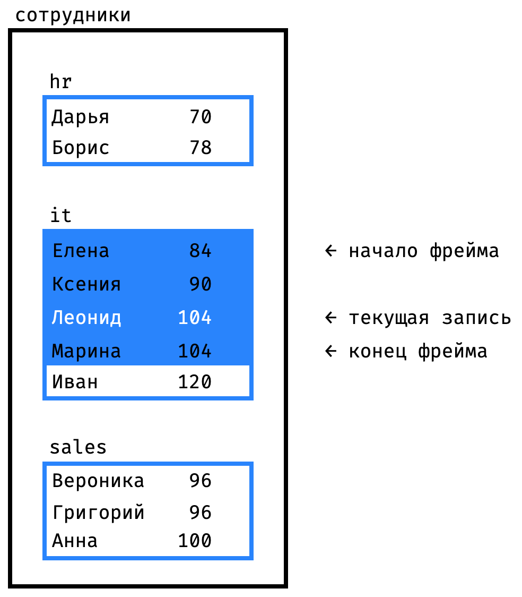</figure>
</div>
</div>

Фрейм находится в той же секции, где текущая запись (Леонид):

- начало фрейма = начало секции (Елена);
- конец фрейма = последняя запись со значением `salary`, равным текущей записи (Марина).

Секция фиксирована, фрейм же зависит от текущей записи и постоянно меняется:
<div class="row">
<div class="col-xs-12 col-sm-6">
    <strong>Секция</strong>
    <figure>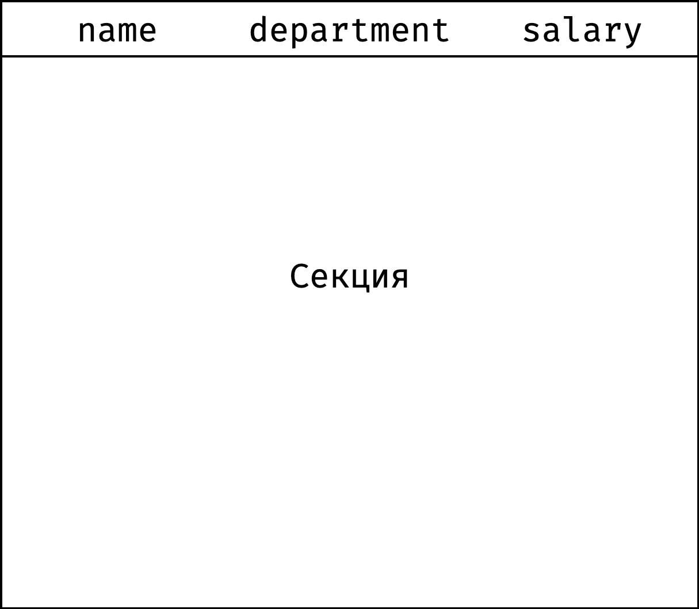</figure>
</div>
<div class="col-xs-12 col-sm-6">
    <strong>Фрейм</strong>
    <figure></figure>
</div>
</div>

`first_value()` возвращает первую строчку фрейма, а не секции. Но поскольку начало фрейма совпадает с началом секции, функция отрабатывает как мы ожидали.

`last_value()` возвращает последнюю строчку фрейма, а не секции. Именно поэтому в нашем запросе она вернула не максимальную зарплату для каждого отдела, а какую-то ерунду.

Чтобы `last_value()` работала как мы ожидаем, придется «прибить» границы фрейма к границам секции. Тогда для каждой секции фрейм будет в точности совпадать с ней:

<div class="row">
<div class="col-xs-12">
    <figure>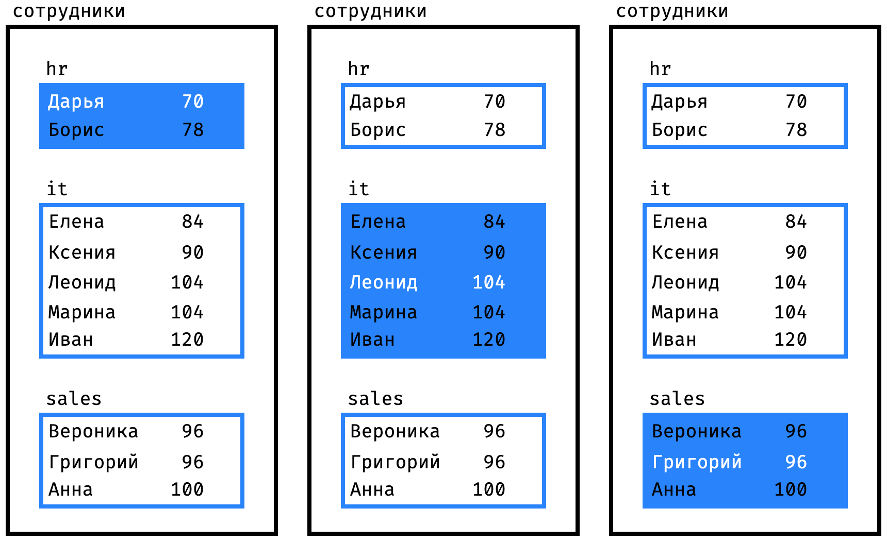</figure>
</div>
</div>

**Зачем так сложно-то?** 🤦 _Если возникла такая реакция — прекрасно вас понимаю. От фреймов есть польза, но зачем авторы стандарта SQL сделали такое неочевидное поведение по умолчанию — я не знаю. Остается только понять и простить._

Подытожим принцип, по которому работают `first_value()` и `last_value()`:

1. Есть _окно_, которое состоит из одной или нескольких _секций_ (`partition by department`).
2. Внутри секции записи упорядочены по конкретному столбцу (`order by salary`).
3. У каждой записи в секции свой _фрейм_. По умолчанию начало фрейма совпадает с началом секции, а конец для каждой записи свой.
4. Конец фрейма можно приклеить к концу секции, чтобы фрейм в точности совпадал с секцией.
5. Функция `first_value()` возвращает значение из первой строки фрейма.
6. Функция `last_value()` возвращает значение из последней строки фрейма.

Теперь разберемся, как прибить фрейм к окну — и закончим с запросом по диапазону зарплат в департаментах.

<h2 id="nth-continued">Диапазон зарплат в департаменте, окончание</h2>

Возьмем наше окно:

```sql
window w as (
  partition by department
  order by salary
)
```

И настроим его, чтобы фрейм в точности совпадал с секцией (департаментом):

```sql
window w as (
  partition by department
  order by salary
  rows between unbounded preceding and unbounded following
)
```

Не будем сейчас разбирать конструкцию `rows between` — ее время придет в статье про скользящие агрегаты. Важно, что благодаря ей фрейм совпадает с секцией, а значит `last_value()` вернет максимальную зарплату по департаменту:

```sql
select
  name, department, salary,
  first_value(salary) over w as low,
  last_value(salary) over w as high
from employees
window w as (
  partition by department
  order by salary
  rows between unbounded preceding and unbounded following
)
order by department, salary, id;
```

```
┌──────────┬────────────┬────────┬─────┬──────┐
│   name   │ department │ salary │ low │ high │
├──────────┼────────────┼────────┼─────┼──────┤
│ Дарья    │ hr         │ 70     │ 70  │ 78   │
│ Борис    │ hr         │ 78     │ 70  │ 78   │
├──────────┼────────────┼────────┼─────┼──────┤
│ Елена    │ it         │ 84     │ 84  │ 120  │
│ Ксения   │ it         │ 90     │ 84  │ 120  │
│ Леонид   │ it         │ 104    │ 84  │ 120  │
│ Марина   │ it         │ 104    │ 84  │ 120  │
│ Иван     │ it         │ 120    │ 84  │ 120  │
├──────────┼────────────┼────────┼─────┼──────┤
│ Вероника │ sales      │ 96     │ 96  │ 100  │
│ Григорий │ sales      │ 96     │ 96  │ 100  │
│ Анна     │ sales      │ 100    │ 96  │ 100  │
└──────────┴────────────┴────────┴─────┴──────┘
```

Теперь движок заполняет `low` и `high` так же, как мы делали это вручную.

<h2 id="functions">Функции смещения</h2>

<table>
    <tbody>
        <tr>
            <td class="nowrap"><code>lag(value, offset)</code></td>
            <td>значение <code>value</code> из строки, отстоящей на <code>offset</code> строк назад от текущей</td>
        </tr>
        <tr>
            <td class="nowrap"><code>lead(value, offset)</code></td>
            <td>значение <code>value</code> из строки, отстоящей на <code>offset</code> строк вперед от текущей</td>
        </tr>
        <tr>
            <td class="nowrap"><code>first_value(value)</code></td>
            <td>значение <code>value</code> из первой строки фрейма</td>
        </tr>
        <tr>
            <td class="nowrap"><code>last_value(value)</code></td>
            <td>значение <code>value</code> из последней строки фрейма</td>
        </tr>
        <tr>
            <td class="nowrap"><code>nth_value(value, n)</code></td>
            <td>значение <code>value</code> из <code>n</code>-й строки фрейма</td>
        </tr>
    </tbody>
</table>

`lag()` и `lead()` действуют относительно текущей строки, заглядывая вперед или назад на указанное количество строк.

<div class="row">
<div class="col-xs-12 col-sm-6">
<figure>
  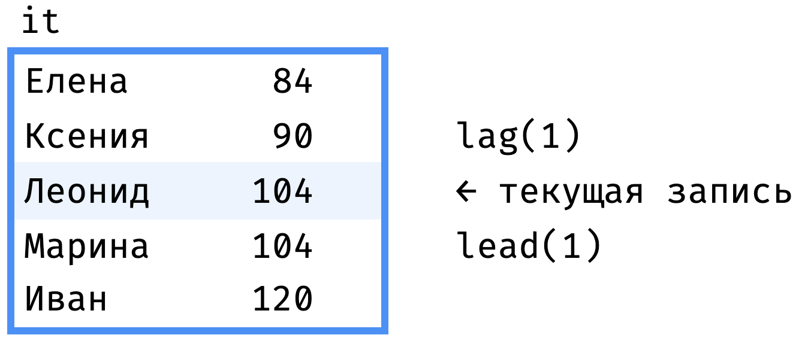
</figure>
</div>
</div>

`first_value()`, `last_value()` и `nth_value()` действуют относительно границ фрейма, выбирая указанную строку в пределах фрейма.

<div class="row">
<div class="col-xs-12 col-sm-6">
    <figure>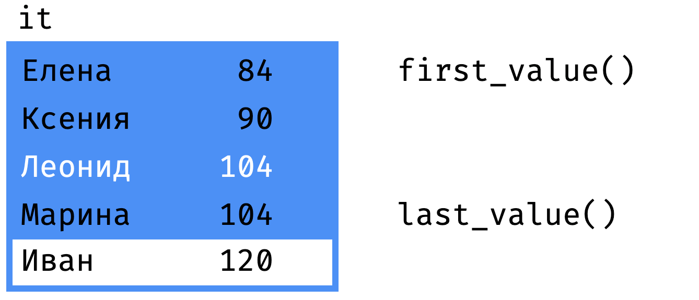</figure>
</div>
<div class="col-xs-12 col-sm-6">
    <figure>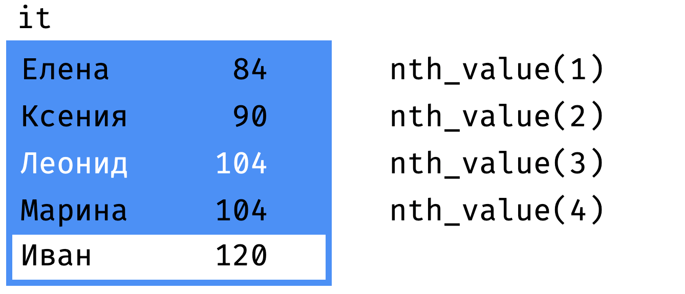</figure>
</div>
</div>

Чтобы границы фрейма совпадали с границами секции (или всего окна, если секция одна) — используют конструкцию `rows between unbounded preceding and unbounded following` в определении окна.

<p class="align-center">⌘ ⌘ ⌘</p>

Мы разобрались, как сравнивать строки с соседями и границами окна. В [следующей части](/window-aggregate/) займемся агрегацией данных!

Чтобы закрепить знания на практике — <a href="https://stepik.org/z/95367"><strong>записывайтесь на курс</strong></a> 🚀
