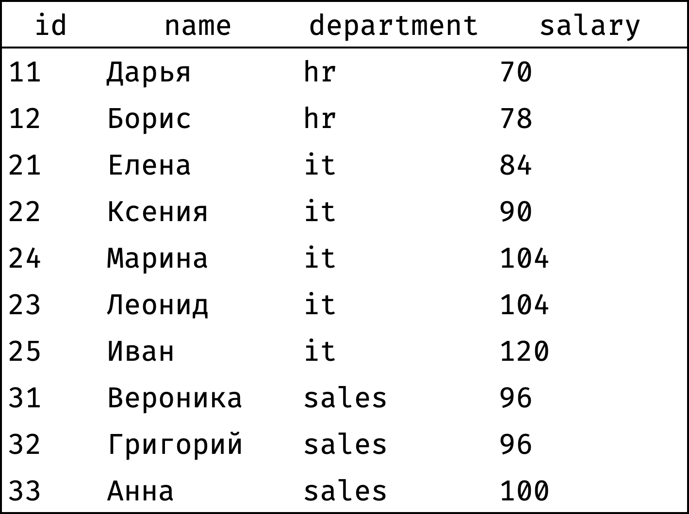

+++
date = 2021-04-05T08:48:00Z
description = "Составляем рейтинги и разбиваем на группы."
image = "/window-ranking/cover.png"
slug = "window-ranking"
tags = ["data", "sqlite"]
title = "Оконные функции: ранжирование"
+++

*Это вторая статья из серии [Оконные функции в картинках](/window-functions). Рекомендую не просто читать, а [проходить курс](https://stepik.org/z/95367) — с ним знания превратятся в навыки.*

В этой части будем решать задачу ранжирования. Ранжирование — это всевозможные рейтинги, начиная от призеров чемпионата мира по плаванию и заканчивая Forbes 500. Мы же будем ранжировать сотрудников компании.

Будем работать с игрушечной таблицей `employees`, вот такой:

```
┌────┬──────────┬────────┬────────────┬────────┐
│ id │   name   │  city  │ department │ salary │
├────┼──────────┼────────┼────────────┼────────┤
│ 11 │ Дарья    │ Самара │ hr         │ 70     │
│ 12 │ Борис    │ Самара │ hr         │ 78     │
│ 21 │ Елена    │ Самара │ it         │ 84     │
│ 22 │ Ксения   │ Москва │ it         │ 90     │
│ 23 │ Леонид   │ Самара │ it         │ 104    │
│ 24 │ Марина   │ Москва │ it         │ 104    │
│ 25 │ Иван     │ Москва │ it         │ 120    │
│ 31 │ Вероника │ Москва │ sales      │ 96     │
│ 32 │ Григорий │ Самара │ sales      │ 96     │
│ 33 │ Анна     │ Москва │ sales      │ 100    │
└────┴──────────┴────────┴────────────┴────────┘
```

<ul>
    <li><a href="#rank">рейтинг зарплат</a>,</li>
    <li><a href="#partition">рейтинг зарплат по департаментам</a>,</li>
    <li><a href="#ntile">группы по зарплате</a>,</li>
    <li><a href="#functions">функции ранжирования</a>.</li>
</ul>

Все запросы можно повторять [в песочнице](https://antonz.org/sqliter/sandbox/#window.db).

<h2 id="rank">Рейтинг зарплат</h2>

Составим рейтинг сотрудников по размеру заработной платы:

<div class="row">
<div class="col-xs-12 col-sm-6">
    <strong>Было</strong>
    <figure></figure>
</div>
<div class="col-xs-12 col-sm-6">
    <strong>Стало</strong>
    <figure></figure>
</div>
</div>

Обратите внимание — сотрудники с одинаковой зарплатой получили один и тот же ранг (Леонид и Марина, Вероника и Григорий).

Как перейти от «было» к «стало»?

Сначала отсортируем таблицу по убыванию зарплаты:

```sql
select
  null as rank,
  name, department, salary
from employees
order by salary desc, id;
```

```
┌──────┬──────────┬────────────┬────────┐
│ rank │   name   │ department │ salary │
├──────┼──────────┼────────────┼────────┤
│      │ Иван     │ it         │ 120    │
│      │ Леонид   │ it         │ 104    │
│      │ Марина   │ it         │ 104    │
│      │ Анна     │ sales      │ 100    │
│      │ Вероника │ sales      │ 96     │
│      │ Григорий │ sales      │ 96     │
│      │ Ксения   │ it         │ 90     │
│      │ Елена    │ it         │ 84     │
│      │ Борис    │ hr         │ 78     │
│      │ Дарья    │ hr         │ 70     │
└──────┴──────────┴────────────┴────────┘
```

Теперь пройдем от первой строчки до последней и проставим ранг каждой записи. Начнем с 1 и будем увеличивать ранг каждый раз, когда значение salary меньше, чем у предыдущей записи:

<div class="row">
<div class="col-xs-12 col-sm-6">
    1️⃣
    <figure></figure>
</div>
<div class="col-xs-12 col-sm-6">
    2️⃣
    <figure></figure>
</div>
</div>
<div class="row">
<div class="col-xs-12 col-sm-6">
    3️⃣
    <figure></figure>
</div>
<div class="col-xs-12 col-sm-6">
    4️⃣
    <figure></figure>
</div>
</div>
<div class="row">
<div class="col-xs-12 col-sm-6">
    5️⃣
    <figure></figure>
</div>
<div class="col-xs-12 col-sm-6 flex" style="align-items:center">
    <p>и так далее...</p>
</div>
</div>

Чтобы проставить ранг, достаточно на каждом шаге смотреть только на значения из столбца `salary`, выделенные синей рамкой. Назовем эти значения окном.

Попробуем описать содержимое окна словами:

- Это значения столбца `salary`.
- Они упорядочены от большего значения к меньшему.

Сформулируем то же самое на SQL:

```
window w as (order by salary desc)
```

- `window` — ключевое слово, которое показывает, что дальше будет определение окна;
- `w` — название окна (может быть любым);
- `(order by salary desc)` — описание окна («значения столбца `salary`, упорядоченные по убыванию»).

Задача — посчитать ранг по окну `w`. На SQL это записывается как `dense_rank() over w`.

`dense_rank()` — это оконная функция, которая считает ранг по указанному окну. Логика `dense_rank()` такая же, как была у нас при ручном подсчете — начать с 1 и увеличивать ранг каждый раз, когда очередное значение из окна отличается от предыдущего.

Добавим окно и оконную функцию в исходный запрос:

```sql
select
  dense_rank() over w as rank,
  name, department, salary
from employees
window w as (order by salary desc)
order by rank, id;
```

```
┌──────┬──────────┬────────────┬────────┐
│ rank │   name   │ department │ salary │
├──────┼──────────┼────────────┼────────┤
│ 1    │ Иван     │ it         │ 120    │
│ 2    │ Леонид   │ it         │ 104    │
│ 2    │ Марина   │ it         │ 104    │
│ 3    │ Анна     │ sales      │ 100    │
│ 4    │ Вероника │ sales      │ 96     │
│ 4    │ Григорий │ sales      │ 96     │
│ 5    │ Ксения   │ it         │ 90     │
│ 6    │ Елена    │ it         │ 84     │
│ 7    │ Борис    │ hr         │ 78     │
│ 8    │ Дарья    │ hr         │ 70     │
└──────┴──────────┴────────────┴────────┘
```

Вот как движок выполняет такой запрос:

1. Берет таблицу, указанную в `from`.
2. Выбирает из нее все записи.
3. Для каждой записи рассчитывает значение `dense_rank()` с помощью окна `w`.
4. Сортирует результат как указано в `order by`.

Вот как отрабатывает шаг 3, на котором назначается ранг:

<div class="row">
<div class="col-xs-12 col-sm-6">
<figure>
  
</figure>
</div>
</div>

<h2 id="partition">Рейтинг зарплат по департаментам</h2>

Теперь составим рейтинг сотрудников по размеру заработной платы независимо по каждому департаменту:

<div class="row">
<div class="col-xs-12 col-sm-6">
    <strong>Было</strong>
    <figure></figure>
</div>
<div class="col-xs-12 col-sm-6">
    <strong>Стало</strong>
    <figure></figure>
</div>
</div>

Как перейти от «было» к «стало»?

Сначала отсортируем таблицу по департаментам, а внутри департамента — по убыванию зарплаты:

```sql
select
  null as rank,
  name, department, salary
from employees
order by department, salary desc, id;
```

```
┌──────┬──────────┬────────────┬────────┐
│ rank │   name   │ department │ salary │
├──────┼──────────┼────────────┼────────┤
│      │ Борис    │ hr         │ 78     │
│      │ Дарья    │ hr         │ 70     │
│      │ Иван     │ it         │ 120    │
│      │ Леонид   │ it         │ 104    │
│      │ Марина   │ it         │ 104    │
│      │ Ксения   │ it         │ 90     │
│      │ Елена    │ it         │ 84     │
│      │ Анна     │ sales      │ 100    │
│      │ Вероника │ sales      │ 96     │
│      │ Григорий │ sales      │ 96     │
└──────┴──────────┴────────────┴────────┘
```

Теперь пройдем от первой строчки до последней и проставим ранг каждой записи. Начнем с 1 и будем увеличивать ранг каждый раз, когда значение `salary` меньше, чем у предыдущей записи. При переходе от департамента к департаменту будем сбрасывать ранг обратно на 1:

<div class="row">
<div class="col-xs-12 col-sm-6">
    1️⃣
    <figure></figure>
</div>
<div class="col-xs-12 col-sm-6">
    2️⃣
    <figure></figure>
</div>
</div>
<div class="row">
<div class="col-xs-12 col-sm-6">
    3️⃣
    <figure></figure>
</div>
<div class="col-xs-12 col-sm-6">
    4️⃣
    <figure></figure>
</div>
</div>
<div class="row">
<div class="col-xs-12 col-sm-6">
    5️⃣
    <figure></figure>
</div>
<div class="col-xs-12 col-sm-6 flex" style="align-items:center">
    <p>и так далее...</p>
</div>
</div>

Чтобы проставить ранг, достаточно на каждом шаге смотреть только на значения из столбца `salary`, выделенные синей рамкой. Это и есть окно в данном случае.

Видно, что окно меняется в зависимости от того, к какому департаменту относится текущая запись. Опишем словами:

- Окно разбито на несколько независимых секций — по одной на департамент.
- Внутри секции записи упорядочены по убыванию зарплаты.

Сформулируем то же самое на SQL:

```
window w as (
  partition by department
  order by salary desc
)
```

- `partition by department` указывает, как следует разбить окно на секции;
- `order by salary` desc задает сортировку внутри секции.

Функция расчета ранга остается прежней — `dense_rank()`.

Добавим окно и оконную функцию в исходный запрос:

```sql
select
  dense_rank() over w as rank,
  name, department, salary
from employees
window w as (
  partition by department
  order by salary desc
)
order by department, rank, id;
```

```
┌──────┬──────────┬────────────┬────────┐
│ rank │   name   │ department │ salary │
├──────┼──────────┼────────────┼────────┤
│ 1    │ Борис    │ hr         │ 78     │
│ 2    │ Дарья    │ hr         │ 70     │
├──────┼──────────┼────────────┼────────┤
│ 1    │ Иван     │ it         │ 120    │
│ 2    │ Леонид   │ it         │ 104    │
│ 2    │ Марина   │ it         │ 104    │
│ 3    │ Ксения   │ it         │ 90     │
│ 4    │ Елена    │ it         │ 84     │
├──────┼──────────┼────────────┼────────┤
│ 1    │ Анна     │ sales      │ 100    │
│ 2    │ Вероника │ sales      │ 96     │
│ 2    │ Григорий │ sales      │ 96     │
└──────┴──────────┴────────────┴────────┘
```

Вот как движок рассчитывает ранг для каждой записи:

<div class="row">
<div class="col-xs-12 col-sm-6">
<figure>
  
</figure>
</div>
</div>

<h2 id="ntile">Группы по зарплате</h2>

Разобьем сотрудников на три группы в зависимости от размера зарплаты:

- высокооплачиваемые,
- средние,
- низкооплачиваемые.

<div class="row">
<div class="col-xs-12 col-sm-6">
    <strong>Было</strong>
    <figure></figure>
</div>
<div class="col-xs-12 col-sm-6">
    <strong>Стало</strong>
    <figure></figure>
</div>
</div>

Как перейти от «было» к «стало»?

Сначала отсортируем таблицу по убыванию зарплаты:

```sql
select
  null as tile,
  name, department, salary
from employees
order by salary desc, id;
```

```
┌──────┬──────────┬────────────┬────────┐
│ tile │   name   │ department │ salary │
├──────┼──────────┼────────────┼────────┤
│      │ Иван     │ it         │ 120    │
│      │ Леонид   │ it         │ 104    │
│      │ Марина   │ it         │ 104    │
│      │ Анна     │ sales      │ 100    │
│      │ Вероника │ sales      │ 96     │
│      │ Григорий │ sales      │ 96     │
│      │ Ксения   │ it         │ 90     │
│      │ Елена    │ it         │ 84     │
│      │ Борис    │ hr         │ 78     │
│      │ Дарья    │ hr         │ 70     │
└──────┴──────────┴────────────┴────────┘
```

Всего 10 записей, 3 группы — значит, две группы по 3 записи и одна 4 записи. Например, так:

```
┌──────┬──────────┬────────────┬────────┐
│ tile │   name   │ department │ salary │
├──────┼──────────┼────────────┼────────┤
│      │ Иван     │ it         │ 120    │
│      │ Леонид   │ it         │ 104    │
│      │ Марина   │ it         │ 104    │
│      │ Анна     │ sales      │ 100    │
├──────┼──────────┼────────────┼────────┤
│      │ Вероника │ sales      │ 96     │
│      │ Григорий │ sales      │ 96     │
│      │ Ксения   │ it         │ 90     │
├──────┼──────────┼────────────┼────────┤
│      │ Елена    │ it         │ 84     │
│      │ Борис    │ hr         │ 78     │
│      │ Дарья    │ hr         │ 70     │
└──────┴──────────┴────────────┴────────┘
```

Чтобы провести границы между группами, придется анализировать все зарплаты, отсортированные по убыванию. Поэтому окно будет таким:

```
window w as (order by salary desc)
```

А вот функция потребуется другая — `ntile(n)`, где `n` — количество групп. В нашем случае:

```sql
select
  ntile(3) over w as tile,
  name, department, salary
from employees
window w as (order by salary desc)
order by salary desc, id;
```

```
┌──────┬──────────┬────────────┬────────┐
│ tile │   name   │ department │ salary │
├──────┼──────────┼────────────┼────────┤
│ 1    │ Иван     │ it         │ 120    │
│ 1    │ Леонид   │ it         │ 104    │
│ 1    │ Марина   │ it         │ 104    │
│ 1    │ Анна     │ sales      │ 100    │
├──────┼──────────┼────────────┼────────┤
│ 2    │ Вероника │ sales      │ 96     │
│ 2    │ Григорий │ sales      │ 96     │
│ 2    │ Ксения   │ it         │ 90     │
├──────┼──────────┼────────────┼────────┤
│ 3    │ Елена    │ it         │ 84     │
│ 3    │ Борис    │ hr         │ 78     │
│ 3    │ Дарья    │ hr         │ 70     │
└──────┴──────────┴────────────┴────────┘
```

`ntile(n)` разбивает все записи на n групп и возвращает номер группы для каждой записи. Если общее количество записей (10 в нашем случае) не делится на размер группы (3), то первые группы будут крупнее последних.

<h2 id="functions">Функции ранжирования</h2>

<table>
    <tbody>
        <tr>
            <td><code>row_number()</code></td>
            <td>порядковый номер строки</td>
        </tr>
        <tr>
            <td><code>dense_rank()</code></td>
            <td>ранг строки</td>
        </tr>
        <tr>
            <td><code>rank()</code></td>
            <td>тоже ранг, но с пропусками</td>
        </tr>
        <tr>
            <td><code>ntile(n)</code></td>
            <td>разбивает все строки на <code>n</code> групп и возвращает номер группы, в которую попала строка</td>
        </tr>
    </tbody>
</table>

`dense_rank()` и `ntile()` мы уже разобрали.

`row_number()` нумерует строки в порядке, указанном в `order by`. Никаких неожиданностей.

`rank()` похож на `dense_rank()`, a разницу проще всего показать на примере.

```sql
select
  ••• over w as rank,
  name, salary
from employees
window w as (order by salary desc)
order by rank, id;
```

В одном случае вместо `•••` укажем `dense_rank()`, а в другом — `rank()`:

<div class="row">
<div class="col-xs-12 col-sm-6">
    <strong>dense_rank()</strong>
    <pre><code>┌──────┬──────────┬────────┐
│ rank │   name   │ salary │
├──────┼──────────┼────────┤
│ 1    │ Иван     │ 120    │
│ 2    │ Леонид   │ 104    │
│ 2    │ Марина   │ 104    │
│ 3    │ Анна     │ 100    │
│ 4    │ Вероника │ 96     │
│ 4    │ Григорий │ 96     │
│ 5    │ Ксения   │ 90     │
│ 6    │ Елена    │ 84     │
│ 7    │ Борис    │ 78     │
│ 8    │ Дарья    │ 70     │
└──────┴──────────┴────────┘</code></pre>
</div>
<div class="col-xs-12 col-sm-6">
    <strong>rank()</strong>
    <pre><code>┌──────┬──────────┬────────┐
│ rank │   name   │ salary │
├──────┼──────────┼────────┤
│ 1    │ Иван     │ 120    │
│ 2    │ Леонид   │ 104    │
│ 2    │ Марина   │ 104    │
│ 4    │ Анна     │ 100    │
│ 5    │ Вероника │ 96     │
│ 5    │ Григорий │ 96     │
│ 7    │ Ксения   │ 90     │
│ 8    │ Елена    │ 84     │
│ 9    │ Борис    │ 78     │
│ 10   │ Дарья    │ 70     │
└──────┴──────────┴────────┘</code></pre>
</div>
</div>

`dense_rank()` назначает Анне третье место, а `rank()` — четвертое, потому что второе-третье уже заняты Леонидом и Мариной. Аналогично с Ксенией после Вероники и Григория. Вот и вся разница.

<p class="align-center">⌘&nbsp;⌘&nbsp;⌘</p>

Мы разобрались, что такое «окно», «оконная функция», и как использовать их для ранжирования данных. В [следующей части](/window-offset/) займемся оконными сравнениями!

Чтобы закрепить знания на практике — <a href="https://stepik.org/z/95367"><strong>записывайтесь на курс</strong></a> 🚀


