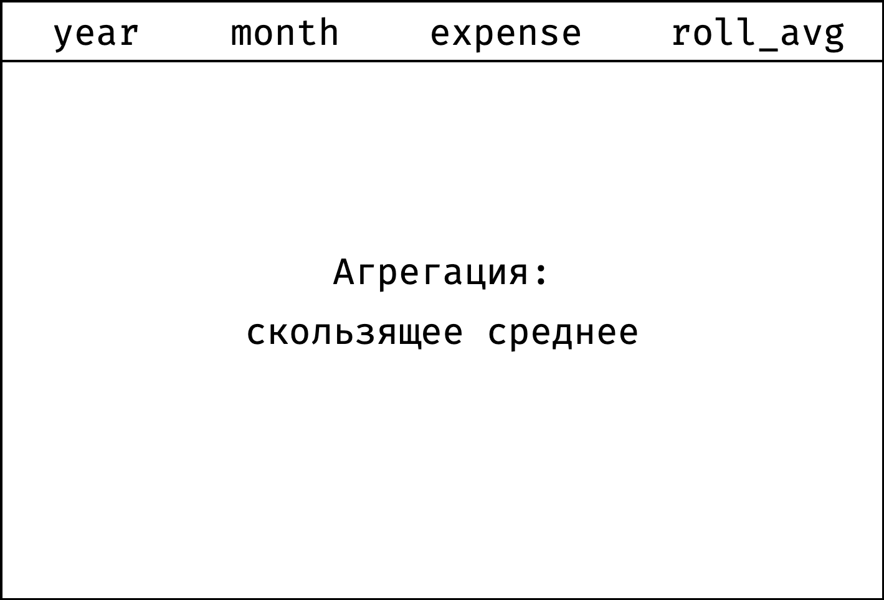

+++
date = 2021-05-13T14:06:22Z
description = "Скользящее среднее и кумулятивная сумма."
image = "/window-rolling/cover.png"
slug = "window-rolling"
tags = ["data", "sqlite"]
title = "Оконные функции: скользящие агрегаты"
+++

_Это пятая, заключительная статья из серии [Оконные функции в картинках](/window-functions). Рекомендую не просто читать, а [проходить курс](https://stepik.org/z/95367) — с ним знания превратятся в навыки._

Скользящие агрегаты — это те же сумма и среднее. Только рассчитывают их не по всем элементам набора, а более хитрым способом.

Разберемся на примерах. Здесь возьмем другую табличку — `expenses`. Она показывает доходы и расходы одного из сотрудников (пусть это будет Марина) за 9 месяцев 2020 года:

```
┌──────┬───────┬────────┬─────────┐
│ year │ month │ income │ expense │
├──────┼───────┼────────┼─────────┤
│ 2020 │ 1     │ 94     │ 82      │
│ 2020 │ 2     │ 94     │ 75      │
│ 2020 │ 3     │ 94     │ 104     │
│ 2020 │ 4     │ 100    │ 94      │
│ 2020 │ 5     │ 100    │ 99      │
│ 2020 │ 6     │ 100    │ 105     │
│ 2020 │ 7     │ 100    │ 95      │
│ 2020 │ 8     │ 100    │ 110     │
│ 2020 │ 9     │ 104    │ 104     │
└──────┴───────┴────────┴─────────┘
```

<ul>
    <li><a href="#rolling-avg">скользящее среднее</a>,</li>
    <li><a href="#frame">фрейм</a>,</li>
    <li><a href="#cumulative-sum">нарастающий итог</a>,</li>
    <li><a href="#functions">функции</a>.</li>
</ul>

Все запросы можно повторять [в песочнице](https://antonz.org/sqliter/sandbox/#window.db).

<h2 id="rolling-avg">Скользящее среднее по расходам</h2>

Судя по данным, доходы у Марины растут: 94К ₽ в январе → 104К ₽ в сентябре. А вот растут ли расходы? Сходу сложно сказать, месяц на месяц не приходится. Чтобы сгладить эти скачки, используют «скользящее среднее» — для каждого месяца рассчитывают средний расход с учетом предыдущего и следующего месяца. Например:

- скользящее среднее за февраль = (январь + февраль + март) / 3;
- за март = (февраль + март + апрель) / 3;
- за апрель = (март + апрель + май) / 3;
- и так далее.

Рассчитаем скользящее среднее по всем месяцам:

<div class="row">
<div class="col-xs-12 col-sm-6">
    <strong>Было</strong>
    <figure></figure>
</div>
<div class="col-xs-12 col-sm-6">
    <strong>Стало</strong>
    <figure></figure>
</div>
</div>

Столбец `roll_avg` показывает скользящее среднее по расходам за три месяца (текущий, предыдущий и следующий). Теперь хорошо видно, что расходы стабильно растут.

Как перейти от «было» к «стало»?

Отсортируем таблицу по месяцам:

```sql
select
  year, month, expense,
  null as roll_avg
from expenses
order by year, month;
```

```
┌──────┬───────┬─────────┬──────────┐
│ year │ month │ expense │ roll_avg │
├──────┼───────┼─────────┼──────────┤
│ 2020 │ 1     │ 82      │          │
│ 2020 │ 2     │ 75      │          │
│ 2020 │ 3     │ 104     │          │
│ 2020 │ 4     │ 94      │          │
│ 2020 │ 5     │ 99      │          │
│ 2020 │ 6     │ 105     │          │
│ 2020 │ 7     │ 95      │          │
│ 2020 │ 8     │ 110     │          │
│ 2020 │ 9     │ 104     │          │
└──────┴───────┴─────────┴──────────┘
```

Теперь пройдем от первой строчки до последней. На каждом шаге будем считать среднее по предыдущему, текущему и следующему значению из столбца `expense`:

<div class="row">
<div class="col-xs-12 col-sm-6">
    1️⃣
    <figure></figure>
</div>
<div class="col-xs-12 col-sm-6">
    2️⃣
    <figure></figure>
</div>
</div>
<div class="row">
<div class="col-xs-12 col-sm-6">
    3️⃣
    <figure></figure>
</div>
<div class="col-xs-12 col-sm-6">
    4️⃣
    <figure></figure>
</div>
</div>
<div class="row">
<div class="col-xs-12 col-sm-6">
    5️⃣
    <figure></figure>
</div>
<div class="col-xs-12 col-sm-6 flex" style="align-items:center">
    <p>и так далее...</p>
</div>
</div>

Одной гифкой:

<div class="row">
<div class="col-xs-12 col-sm-6">
<figure>
  
</figure>
</div>
</div>

Окно на каждом шаге сдвигается вниз, скользит — так и получается скользящее среднее. Чтобы описать на SQL, придется вспомнить концепцию фреймов, с которой мы познакомились в [статье о смещении](/window-offset/):

1. Окно состоит из одной или нескольких секций (в нашем случае секция одна — все записи `expenses`).
2. Внутри секции записи упорядочены по конкретным столбцам (`order by year, month`).
3. У каждой записи свой фрейм.

Фрейм на каждом шаге охватывает три записи — текущую, предыдущую и следующую:

<div class="row">
<div class="col-xs-12 col-sm-6">
    <figure></figure>
</div>
<div class="col-xs-12 col-sm-6">
    <figure></figure>
</div>
</div>

Вот как записать это на SQL:

```
window w as (
  order by year, month
  rows between 1 preceding and 1 following
)
```

С `order by` все понятно, а вторая строчка — это как раз определение фрейма: «выбрать строки от 1 предыдущей до 1 следующей». На следующем шаге разберемся с фреймами подробно, а пока закончим с нашим запросом.

Считаем среднее по расходам — это функция `avg()`:

```
avg(expense) over w
```

Добавим округление и сведем все вместе:

```sql
select
  year, month, expense,
  round(avg(expense) over w) as roll_avg
from expenses
window w as (
  order by year, month
  rows between 1 preceding and 1 following
)
order by year, month;
```

```
┌──────┬───────┬─────────┬──────────┐
│ year │ month │ expense │ roll_avg │
├──────┼───────┼─────────┼──────────┤
│ 2020 │ 1     │ 82      │ 79.0     │
│ 2020 │ 2     │ 75      │ 87.0     │
│ 2020 │ 3     │ 104     │ 91.0     │
│ 2020 │ 4     │ 94      │ 99.0     │
│ 2020 │ 5     │ 99      │ 99.0     │
│ 2020 │ 6     │ 105     │ 100.0    │
│ 2020 │ 7     │ 95      │ 103.0    │
│ 2020 │ 8     │ 110     │ 103.0    │
│ 2020 │ 9     │ 104     │ 107.0    │
└──────┴───────┴─────────┴──────────┘
```

Скользящее среднее по расходам готово!

<h2 id="frame">Фрейм</h2>

В общем случае определение фрейма выглядит так:

```
rows between X preceding and Y following
```

Где `X` — количество строк перед текущей, а `Y` — количество строк после текущей:

<div class="row">
<div class="col-xs-12 col-sm-6">
    <figure></figure>
</div>
<div class="col-xs-12 col-sm-6">
    <figure></figure>
</div>
</div>

Если указать вместо `X` или `Y` значение `unbounded` — это значит «граница секции»:

<div class="row">
<div class="col-xs-12 col-sm-6">
    <figure></figure>
</div>
<div class="col-xs-12 col-sm-6">
    <figure></figure>
</div>
</div>

Если указать вместо `X preceding` или `Y following` значение `current row` — это значит «текущая запись»:

<div class="row">
<div class="col-xs-12 col-sm-6">
    <figure></figure>
</div>
<div class="col-xs-12 col-sm-6">
    <figure></figure>
</div>
</div>

Фрейм никогда не выходит за границы секции, если столкнулся с ней — обрезается:

<div class="row">
<div class="col-xs-12 col-sm-6">
    <figure></figure>
</div>
<div class="col-xs-12 col-sm-6">
    <figure></figure>
</div>
</div>

Вообще, у фреймов намного больше возможностей, но мы ограничимся этими. Подробности разберем на курсе.

<h2 id="cumulative-sum">Прибыль нарастающим итогом</h2>

Благодаря скользящему среднему, мы выяснили, что в `expenses` растут и доходы, и расходы. А как они соотносятся друг с другом? Хочется понять, находится ли человек «в плюсе» или «в минусе» с учетом всех заработанных и потраченных денег.

Причем важно понимать не на конец года, а на каждый месяц. Потому что если по итогам года у Марины все ОК, а в июне ушла в минус — это потенциальная проблема (у компаний такую ситуацию называют «кассовым разрывом»).

Поэтому посчитаем доходы и расходы по месяцам нарастающим итогом (кумулятивно):

- кумулятивный доход за январь = январь;
- за февраль = январь + февраль;
- за март = январь + февраль + март;
- за апрель = январь + февраль + март + апрель;
- и так далее.

<div class="row">
<div class="col-xs-12 col-sm-8">
    <figure></figure>
</div>
</div>

`t_income` показывает доходы нарастающим итогом, `t_expense` — расходы, а `t_profit` — прибыль.

```
t_profit = t_income - t_expense
```

Как рассчитать кумулятивные показатели?

Отсортируем таблицу по месяцам:

```sql
select
  year, month, income, expense,
  null as t_income,
  null as t_expense,
  null as t_profit
from expenses
order by year, month;
```

```
┌──────┬───────┬────────┬─────────┬──────────┬───────────┬──────────┐
│ year │ month │ income │ expense │ t_income │ t_expense │ t_profit │
├──────┼───────┼────────┼─────────┼──────────┼───────────┼──────────┤
│ 2020 │ 1     │ 94     │ 82      │          │           │          │
│ 2020 │ 2     │ 94     │ 75      │          │           │          │
│ 2020 │ 3     │ 94     │ 104     │          │           │          │
│ 2020 │ 4     │ 100    │ 94      │          │           │          │
│ 2020 │ 5     │ 100    │ 99      │          │           │          │
│ 2020 │ 6     │ 100    │ 105     │          │           │          │
│ 2020 │ 7     │ 100    │ 95      │          │           │          │
│ 2020 │ 8     │ 100    │ 110     │          │           │          │
│ 2020 │ 9     │ 104    │ 104     │          │           │          │
└──────┴───────┴────────┴─────────┴──────────┴───────────┴──────────┘
```

Теперь пройдем от первой строчки до последней. На каждом шаге будем считать суммарные показатели от начала таблицы до текущей строки:

<div class="row">
<div class="col-xs-12 col-sm-6">
    1️⃣
    <figure></figure>
</div>
<div class="col-xs-12 col-sm-6">
    2️⃣
    <figure></figure>
</div>
</div>
<div class="row">
<div class="col-xs-12 col-sm-6">
    3️⃣
    <figure></figure>
</div>
<div class="col-xs-12 col-sm-6">
    4️⃣
    <figure></figure>
</div>
</div>
<div class="row">
<div class="col-xs-12 col-sm-6">
    5️⃣
    <figure></figure>
</div>
<div class="col-xs-12 col-sm-6 flex" style="align-items:center">
    <p>и так далее...</p>
</div>
</div>

Одной гифкой:

<div class="row">
<div class="col-xs-12 col-sm-8">
<figure>
  
</figure>
</div>
</div>

Окно на каждом шаге охватывает строки от начала таблицы до текущей записи. Мы уже значем, как сформулировать подходящий фрейм:

```
window w as (
  order by year, month
  rows between unbounded preceding and current row
)
```

Считаем сумму по доходам и расходам — это функция `sum()`:

```
sum(income) over w as t_income,
sum(expense) over w as t_expense,
```

Прибыль считаем как разницу между доходами и расходами:

```
(sum(income) over w) - (sum(expense) over w) as t_profit
```

Все вместе:

```sql
select
  year, month, income, expense,
  sum(income) over w as t_income,
  sum(expense) over w as t_expense,
  (sum(income) over w) - (sum(expense) over w) as t_profit
from expenses
window w as (
  order by year, month
  rows between unbounded preceding and current row
)
order by year, month;
```

```
┌──────┬───────┬────────┬─────────┬──────────┬───────────┬──────────┐
│ year │ month │ income │ expense │ t_income │ t_expense │ t_profit │
├──────┼───────┼────────┼─────────┼──────────┼───────────┼──────────┤
│ 2020 │ 1     │ 94     │ 82      │ 94       │ 82        │ 12       │
│ 2020 │ 2     │ 94     │ 75      │ 188      │ 157       │ 31       │
│ 2020 │ 3     │ 94     │ 104     │ 282      │ 261       │ 21       │
│ 2020 │ 4     │ 100    │ 94      │ 382      │ 355       │ 27       │
│ 2020 │ 5     │ 100    │ 99      │ 482      │ 454       │ 28       │
│ 2020 │ 6     │ 100    │ 105     │ 582      │ 559       │ 23       │
│ 2020 │ 7     │ 100    │ 95      │ 682      │ 654       │ 28       │
│ 2020 │ 8     │ 100    │ 110     │ 782      │ 764       │ 18       │
│ 2020 │ 9     │ 104    │ 104     │ 886      │ 868       │ 18       │
└──────┴───────┴────────┴─────────┴──────────┴───────────┴──────────┘
```

По `t_profit` видно, что дела у Марины идут неплохо. В некоторых месяцах расходы превышают доходы, но благодаря накопленной «денежной подушке» кассового разрыва не происходит.

<h2 id="functions">Функции агрегации</h2>

Скользящие агрегаты используют те же самые функции, что и агрегаты обычные:

- `min()` и `max()`
- `count()`, `avg()` и `sum()`

Разница только в наличии фрейма у скользящих агрегатов.

<p class="text-centered">⌘ ⌘ ⌘</p>

Мы рассмотрели четыре класса задач, которые решаются с помощью оконных функций в SQL:

- Ранжирование (всевозможные рейтинги).
- Сравнение со смещением (соседние элементы и границы).
- Агрегация (количество, сумма и среднее).
- Скользящие агрегаты (сумма и среднее в динамике).

Теперь попробуйте применить «окошки» на практике!

Чтобы узнать больше об оконных функциях или потренироваться — <a href="https://stepik.org/z/95367"><strong>записывайтесь на курс</strong></a> 🚀


