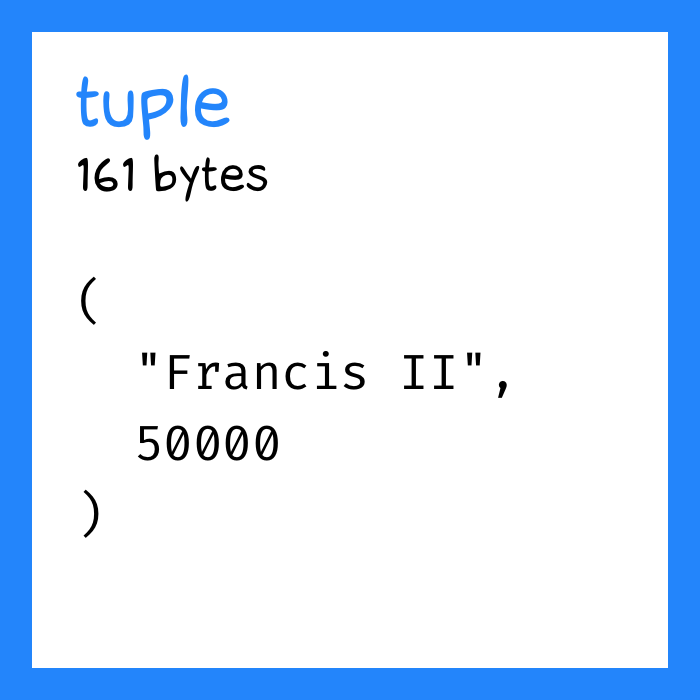
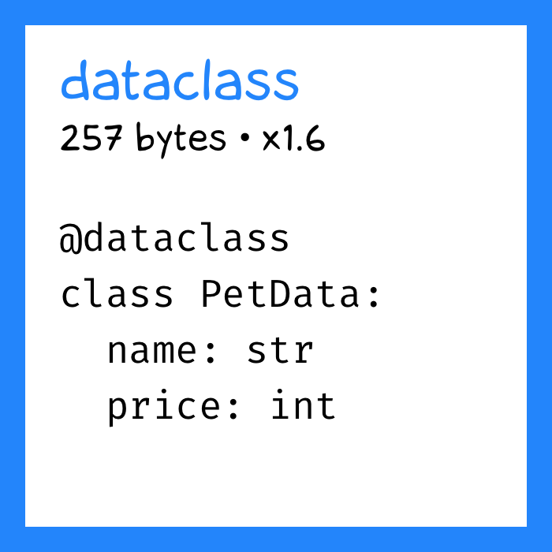
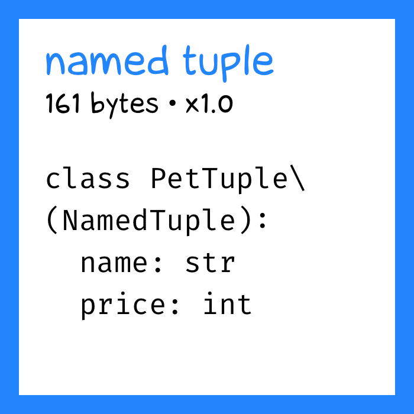
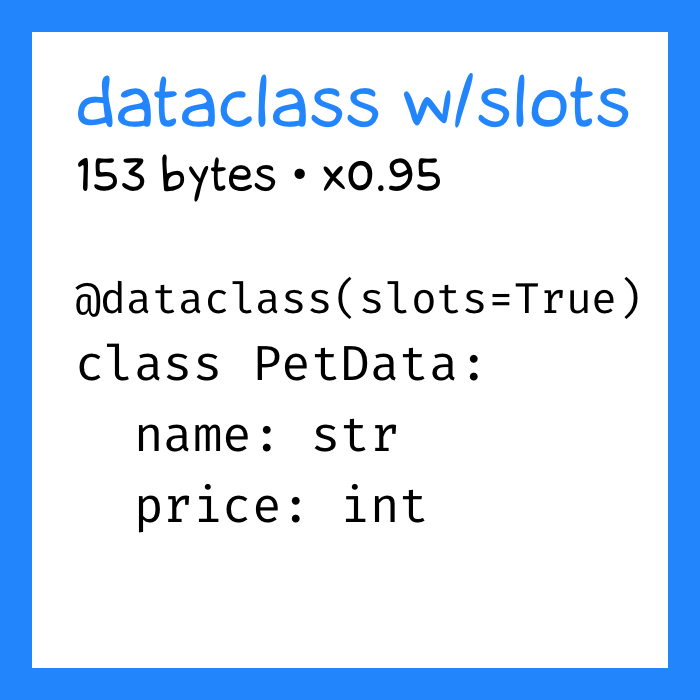
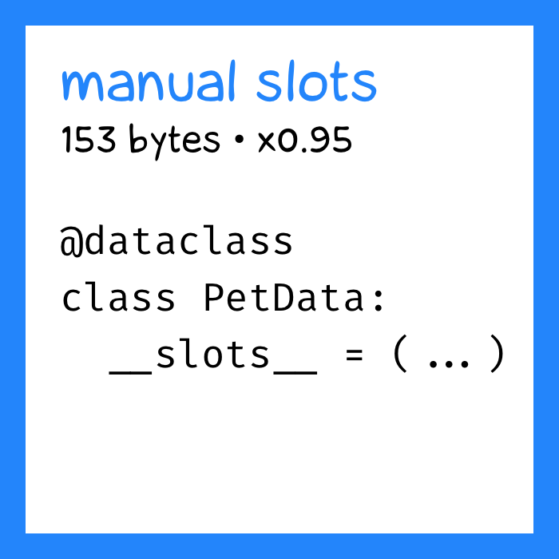
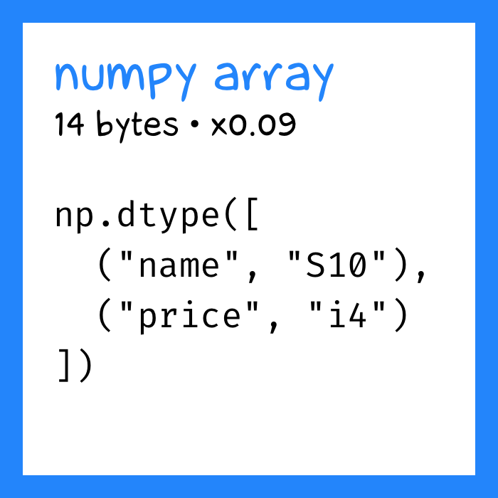

+++
date = 2022-05-13T20:25:00Z
title = "Компактные объекты в Python"
description = "Кортеж против датакласса, пока не вмешается numpy"
image = "/compact-objects/cover.png"
slug = "compact-objects"
tags = ["ohmypy"]
subscribe = "ohmypy"
+++

Питон — объектный язык. Это здорово и удобно, пока не придется создать 10 млн объектов в памяти, которые благополучно ее и съедят. Поговорим о том, как уменьшить аппетит.

_Используйте [песочницу](https://colab.research.google.com/drive/1oKl4rda2apWORLxYYtN9J49r3Mj3L6J9?usp=sharing), чтобы попробовать примеры_

## Кортеж

Допустим, есть у вас простенький объект «питомец» с атрибутами «имя» (строка) и «стоимость» (целое). Интуитивно кажется, что самое компактное предоставление — в виде кортежа:

```python
("Frank the Pigeon", 50000)
```

Замерим, сколько займет в памяти один такой красавчик:

```python
import random
from pympler.asizeof import asizeof

def fields():
    name_gen = (random.choice(string.ascii_uppercase) for _ in range(10))
    name = "".join(name_gen)
    price = random.randint(10000, 99999)
    return (name, price)

def measure(name, fn, n=10_000):
    pets = [fn() for _ in range(n)]
    size = round(asizeof(pets) / n)
    print(f"Pet size ({name}) = {size} bytes")
    return size

baseline = measure("tuple", fields)
```

```
Pet size (tuple) = 161 bytes
```

161 байт. Будем использовать как основу для сравнения.

## Датакласс против именованного кортежа

С чистыми кортежами, конечно, работать неудобно. Наверняка вы используете датакласс:

```python
from dataclasses import dataclass

@dataclass
class PetData:
    name: str
    price: int

fn = lambda: PetData(*fields())
measure("dataclass", fn)
```

```
Pet size (dataclass) = 257 bytes
x1.60 to baseline
```

Ого, какой толстенький!

Попробуем использовать именованный кортеж:

```python
from typing import NamedTuple

class PetTuple(NamedTuple):
    name: str
    price: int


fn = lambda: PetTuple(*fields())
measure("named tuple", fn)
```

```
Pet size (named tuple) = 161 bytes
x1.00 to baseline
```

Теперь вы понимаете, за что я его [так люблю](/namedtuple/). Удобный интерфейс как у датакласса — а вес как у кортежа. Идеально. Или нет?

## Слоты

В Python 3.10 приехали датаклассы со слотами:

```python
@dataclass(slots=True)
class PetData:
    name: str
    price: int


fn = lambda: PetData(*fields())
measure("dataclass w/slots", fn)
```

```
Pet size (dataclass w/slots) = 153 bytes
x0.95 to baseline
```

Ого! Магия слотов создает специальные худощавые объекты, у которых внутри нет словаря, в отличие от обычных питонячих объектов. И такой датакласс ничуть не уступает кортежу.

Что делать, если 3.10 вам еще не завезли? Использовать `NamedTuple`. Или прописывать слоты вручную:

```python
@dataclass
class PetData:
    __slots__ = ("name", "price")
    name: str
    price: int
```

У слотовых объектов есть свои недостатки. Но они отлично подходят для простых случаев (без наследования и прочих наворотов).

## numpy-массив

Конечно, настоящий победитель — numpy-массив:

```python
import string
import numpy as np

PetNumpy = np.dtype([("name", "S10"), ("price", "i4")])
generator = (fields() for _ in range(n))
pets = np.fromiter(generator, dtype=PetNumpy)
size = round(asizeof(pets) / n)
```

```
Pet size (numpy array) = 14 bytes
x0.09 to baseline
```

Но и с `numpy` есть нюансы. Если строки юникодные (тип `U` вместо `S`), выигрыш будет не таким впечатляющим:

```python
PetNumpy = np.dtype([("name", "U10"), ("price", "i4")])
```

```
Pet size (numpy U10) = 44 bytes
x0.27 to baseline
```

А если длина имени не строго 10 символов, а варьируется, скажем, до 50 символов (`U50` вместо `U10`) — преимущества и вовсе сходят на нет:

```python
def fields():
    name_len = random.randint(10, 50)
    name_gen = (random.choice(string.ascii_uppercase) for _ in range(name_len))
    # ...

PetNumpy = np.dtype([("name", "U50"), ("price", "i4")])
```

```
Pet size (tuple) = 179 bytes

Pet size (numpy U50) = 204 bytes
x1.14 to baseline
```

## Другие варианты

Для объективности рассмотрим и альтернативы.

Обычный класс по размеру не отличается от датакласса:

```python
class PetClass:
    def __init__(self, name: str, price: int):
        self.name = name
        self.price = price
```

```
Pet size (class) = 257 bytes
x1.60 to baseline
```

И «замороженный» (неизменяемый) датакласс тоже:

```python
@dataclass(frozen=True)
class PetDataFrozen:
    name: str
    price: int
```

```
Pet size (frozen dataclass) = 257 bytes
x1.60 to baseline
```

Pydantic-модель ставит антирекорд (неудивительно, она ведь использует наследование):

```python
from pydantic import BaseModel

class PetModel(BaseModel):
    name: str
    price: int
```

```
Pet size (pydantic) = 385 bytes
x2.39 to baseline
```

<p class="align-center">⌘&nbsp;⌘&nbsp;⌘</p>

Компактные (и не очень) объекты в Python:

<div class="row">
<div class="col-xs-12 col-sm-4">
<figure></figure>
</div>
<div class="col-xs-12 col-sm-4">
<figure></figure>
</div>
<div class="col-xs-12 col-sm-4">
<figure></figure>
</div>
</div>

<div class="row">
<div class="col-xs-12 col-sm-4">
<figure></figure>
</div>
<div class="col-xs-12 col-sm-4">
<figure></figure>
</div>
<div class="col-xs-12 col-sm-4">
<figure></figure>
</div>
</div>
