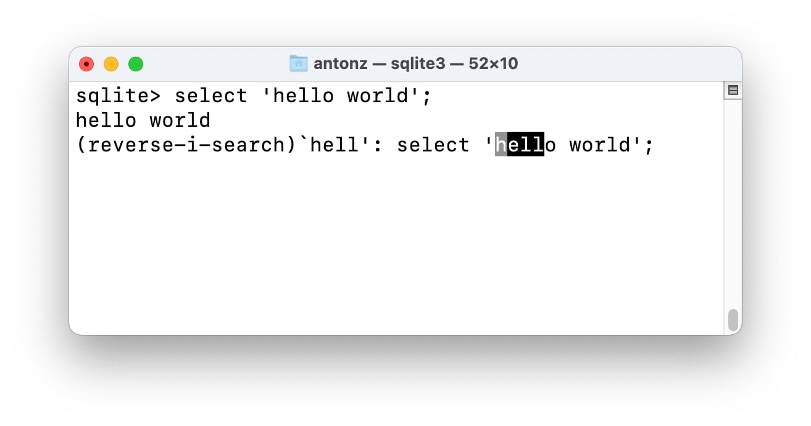
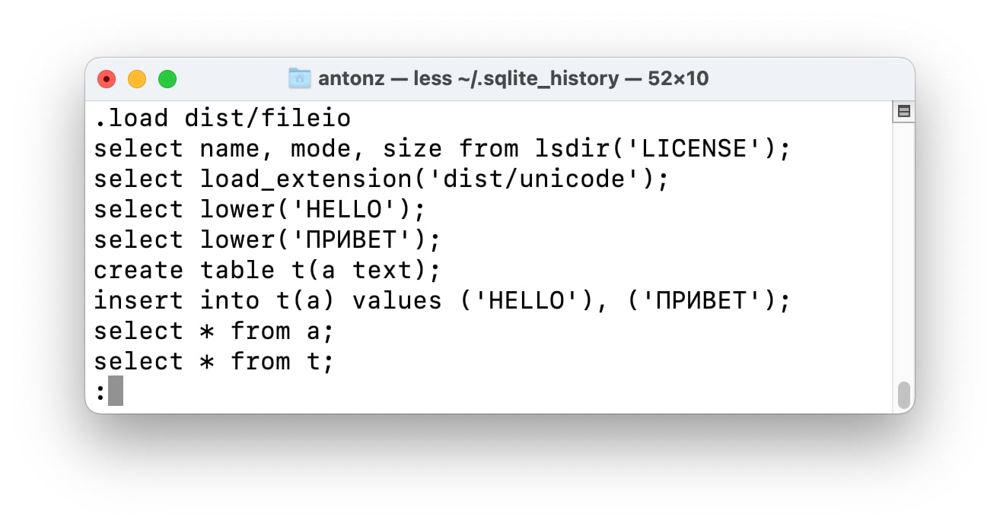

+++
date = 2022-04-17T14:50:00Z
title = "История команд SQLite"
description = "Помогает найти запрос, чтобы не вводить заново."
image = "/sqlite-history/cover.png"
slug = "sqlite-history"
tags = ["sqlite"]
+++

Если вы используете консоль SQLite (`sqlite3` или `sqlite3.exe`), то она помнит последние 2000 выполненных команд. Чтобы повторить последнюю команду, достаточно нажать клавишу `↑`, а поиск работает по сочетанию `Ctrl+R`.

<figure>
  
  <figcaption>Быстрее найти старый запрос, чем вбивать заново</figcaption>
</figure>

По умолчанию файл истории хранится в каталоге пользователя и называется `.sqlite_history`. Он текстовый, так что можно просматривать хоть в редакторе. Если хотите сохранить в другом месте — укажите полный путь в переменной окружения `SQLITE_HISTORY`.

<figure>
  
  <figcaption>Синхронизируйте файл истории через Яндекс-диск или Дропбокс, чтобы искать запросы на всех устройствах</figcaption>
</figure>

История записывается в файл при штатном выходе из консоли, так что если «моргнет» электричество или еще что — команды, выполненные с последнего запуска sqlite3, потеряются.

Конечно, запись истории — не единственная фича консоли. Например, через нее удобно [импортировать и экспортировать данные](https://stepik.org/lesson/469658/step/1?unit=460482) или работать с несколькими базами одновременно. А вот отлаживать многострочные запросы — не слишком удобно 🤷‍♀️

<em>И подписывайтесь на канал <i class="fas fa-database"></i> «<a href="https://t.me/sqliter">SQLite на практике</a>»</em>

