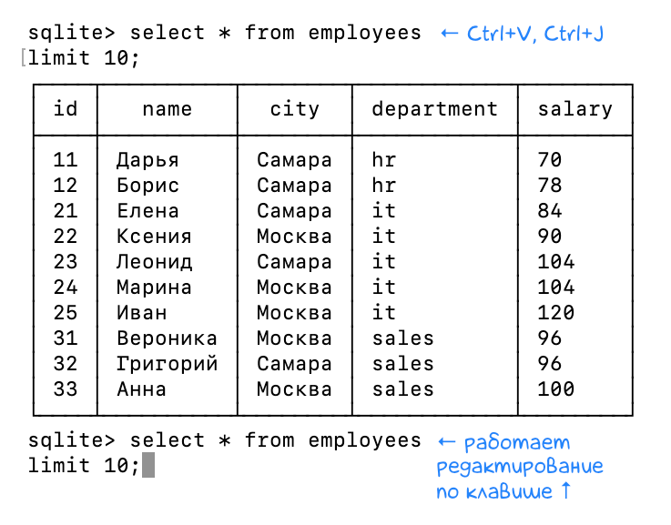

+++
date = 2022-04-24T21:30:00Z
title = "Многострочные запросы в консоли SQLite"
description = "Как отредактировать большой запрос за один раз"
image = "/sqlite-multiline/cover.png"
slug = "sqlite-multiline"
tags = ["sqlite"]
+++

Стоило написать, что отлаживать многострочные запросы [в консоли SQLite](/sqlite-history/) неудобно, как вычитал на sqlite-форуме классный трюк:

Достаточно вместо `Enter` использовать для перехода на новую строку сочетание `Ctrl+V`, `Ctrl+J` — и многострочный запрос редактируется одним куском!

<figure>
  
</figure>

Еще несколько способов, которые используют люди:

-   Внешний редактор (`.shell <editor> <file>`)
-   Запуск из файла (`.read <file>`)
-   DBeaver, DataGrip или аналоги

<em>И подписывайтесь на канал <i class="fas fa-database"></i> «<a href="https://t.me/sqliter"><strong>SQLite на практике</strong></a>»</em>

