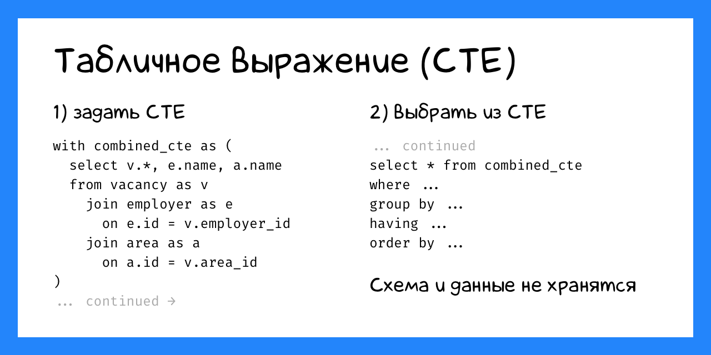
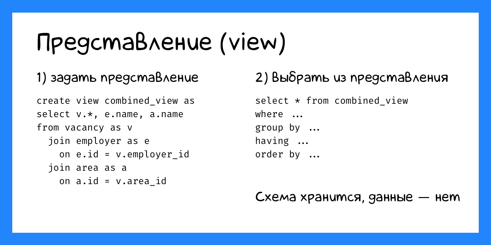
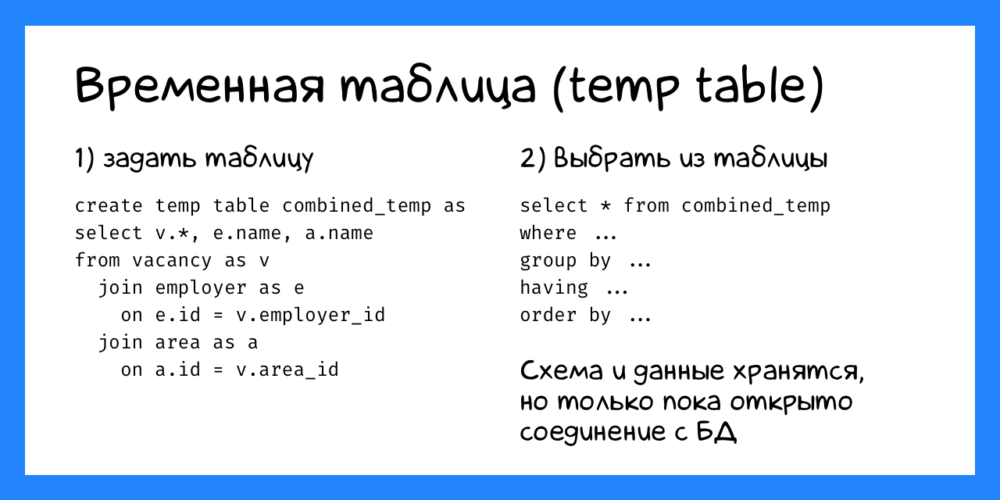

+++
date = 2022-05-18T21:30:00Z
title = "Временные таблицы в SQLite"
description = "Для быстрого исследовательского анализа данных."
image = "/temp-tables/cover.png"
slug = "temp-tables"
tags = ["sqlite"]
subscribe = "sqliter"
+++

Бывает, хочется собрать данные из нескольких таблиц в одну, и дальше с ними поработать. Например, выбрать вакансии вместе с работодателями и регионами:


```sql
select v.*, e.name, a.name
from vacancy as v
  join employer as e on e.id = v.employer_id
  join area as a on a.id = v.area_id
```

Вопрос, как дальше запускать запросы по сводным данным. Есть три способа это сделать:

1. Табличное выражение (CTE)
2. Представление (view)
3. Временная таблица (temporary table)



**Табличное выражение** — это подзапрос с именем:

```sql
with combined_cte as (
  select v.*, e.name, a.name
  from vacancy as v
    join employer as e on e.id = v.employer_id
    join area as a on a.id = v.area_id
)
select ...
from combined_cte
where ...
group by ...
order by ...
```

Я подробно описывал CTE [в отдельной заметке](/cte/), так что не буду повторяться. Важно, что CTE каждый раз вычисляется заново, так что если наш сводный селект не особо быстрый — запросы по нему будут тормозить.



**Представление** работает как CTE, но к нему можно обращаться как к обычной таблице и не повторять каждый раз подзапрос. Как и CTE, представление тоже вычисляется на лету.

```sql
-- 1) create once
create view combined_view as
select v.*, e.name, a.name
from vacancy as v
  join employer as e on e.id = v.employer_id
  join area as a on a.id = v.area_id;

-- 2) use everywhere
select ...
from combined_view
where ...
group by ...
order by ...
```

В PostgreSQL и других СУБД есть материализованные представления, которые сохраняют данные на диск. Но не в SQLite.



**Временная таблица** — такая же, как настоящая: хранит данные на диске, можно построить индексы. Но существует она, только пока открыто соединение с базой данных.

```sql
-- 1) create once
create temp table combined_temp as
select v.*, e.name, a.name
from vacancy as v
  join employer as e on e.id = v.employer_id
  join area as a on a.id = v.area_id;

-- 2) use everywhere
select ...
from combined_temp
where ...
group by ...
order by ...
```

Технически, SQLite хранит временные таблицы в специальной `temp`-базе. Она лежит в отдельном файле на диске и видна только тому соединению БД, в котором была создана. Как только соединение закрывается, SQLite автоматически удаляет временную базу.

<div class="boxed">
<p><strong>Где находится временная база</strong></p>

На юниксо-подобных системах временная база лежит в одном из следующих каталогов:

1. Каталог, заданный прагмой `PRAGMA temp_store_directory` (объявлена устаревшей)
2. Переменная окружения `SQLITE_TMPDIR`
3. Переменная окружения `TMPDIR`
4. `/var/tmp`
5. `/usr/tmp`
6. `/tmp`
7. Текущий рабочий каталог (`.`)

SQLite выбирает первый вариант из списка, для которого есть разрешения на запись (write) и исполнение (execute).

[документация](https://sqlite.org/tempfiles.html)

</div>

Временные таблицы отлично подходят для экспериментов, когда вы только знакомитесь с данными. Можно позволить себе любые безумства — ведь после отключения от базы все будет забыто ツ
